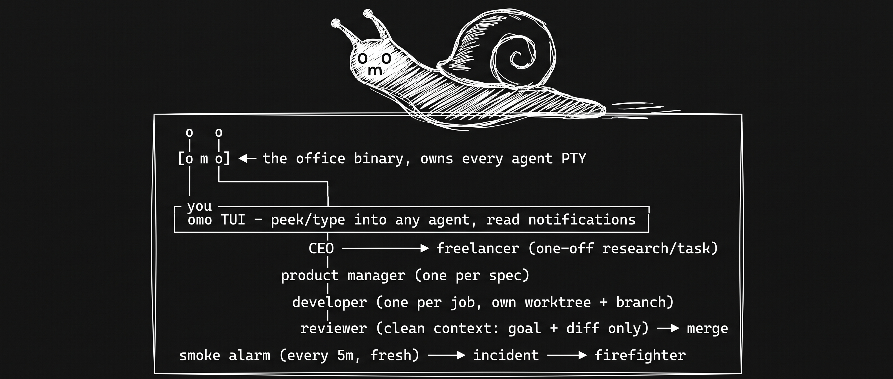
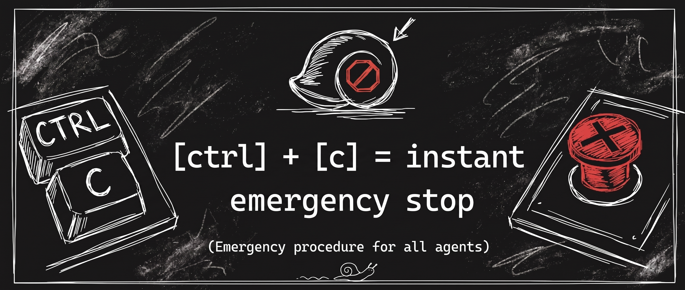
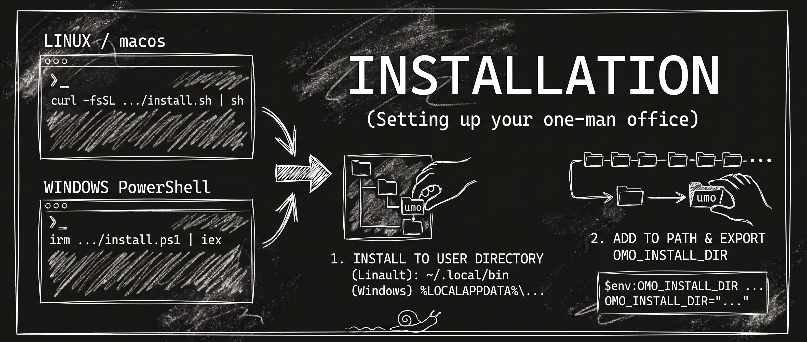
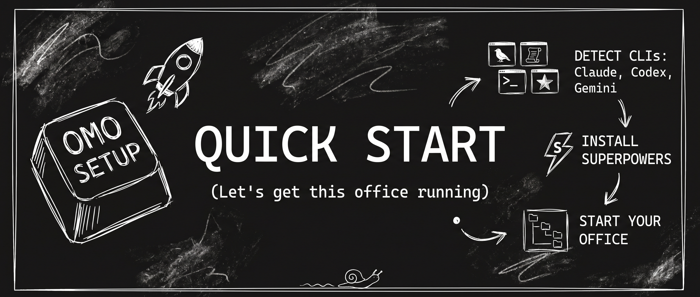
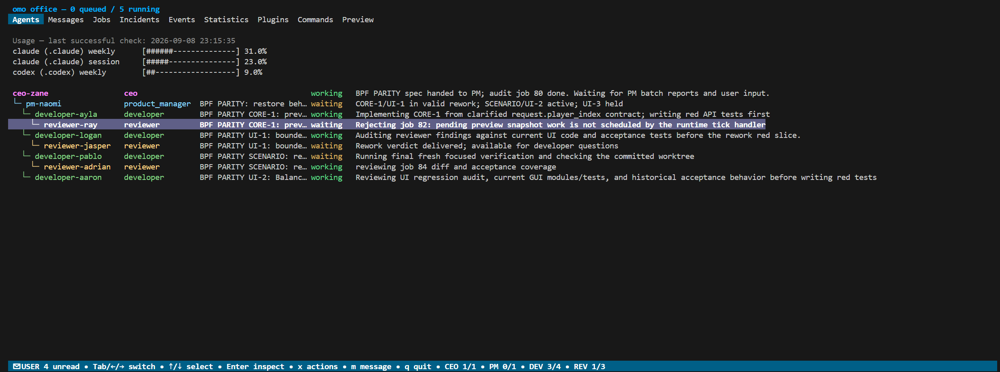

# one-man-office (omo)



Run a small company of AI CLI agents across one or more local Git repositories from a single terminal.

You talk to the **CEO**. The CEO writes specs and delegates them to **product managers**, who split the work into **developer** jobs. Each developer works in its own worktree and branch, and a **reviewer** checks the result before it merges. In parallel, a **smoke alarm** watches for stuck or unhealthy agents and can raise an incident for a **firefighter** to resolve.

`omo` is a single self-contained Go binary. It owns every agent PTY itself, so there is no tmux, daemon, or attach workflow. Closing `omo` stops the office, while the persistent job queue makes restarts cheap.

> [!NOTE]
> `omo` is fully functional, but it is still an early-stage project. Until version 1.0.0, behavior, configuration, commands, and compatibility may change or break between releases.

> [!WARNING]
> **Never run `omo` unattended.** By design, `omo` must launch agents in "unsafe" or unattended modes that do not pause for human approval before taking actions. This is **mostly** acceptable under active supervision, but combining these permissions with live web content creates a prompt-injection risk that can lead to destructive commands, data exposure, or other serious security incidents. Disable ordinary web access where possible. If web access is required, reserve it for the CEO or other higher-tier models that are more resistant - but not immune - to prompt injection. You assume all risks from using `omo`; the project and its maintainers are not liable for damages caused by `omo` or by the unattended permissions in its default configuration.



## How the office works

```text
   o   o
   │   │
  [o m o] ◀─ the office binary, owns every agent PTY
   │   │
   │   └────────────────┐
   │                    │
┌─ you ─────────────────┴──────────────────────────────────┐
│ omo TUI  -  peek/type into any agent, read notifications │
└───────────────────────┬──────────────────────────────────┘
                        │
                      CEO ─────────────► freelancer   (one-off research/task)
                        │
                 product manager  (one per spec)
                        │
                    developer  (one per job, own worktree + branch)
                        │
                     reviewer  (clean context: goal + diff only) ──► merge

         smoke alarm (every 5m, fresh) ──► incident ──► firefighter
```

**Use omo when** a substantial feature spans several components or repositories and benefits from parallel planning, implementation, review, and integration, or when you have a backlog of reasonably independent jobs that should keep moving with durable status, supervision, review cycles, and restart recovery.

**Prefer a normal single-agent session when** the task is a small, focused fix or question, or when the work is highly exploratory and needs a tight conversation in one shared context.

Read more in [Core concepts](wiki/concepts.md).

## Install



### Linux and macOS

```bash
curl -fsSL https://raw.githubusercontent.com/scolastico-dev/one-man-office/main/install.sh | sh
```

Or download and inspect the script before running it:

```bash
curl -fsSLO https://raw.githubusercontent.com/scolastico-dev/one-man-office/main/install.sh
sh install.sh
```

### Windows PowerShell

```powershell
irm https://raw.githubusercontent.com/scolastico-dev/one-man-office/main/install.ps1 | iex
```

To inspect it first:

```powershell
Invoke-WebRequest https://raw.githubusercontent.com/scolastico-dev/one-man-office/main/install.ps1 -OutFile install.ps1
.\install.ps1
```

### What the installers do

- Detect the operating system and CPU architecture.
- Verify the latest release checksum.
- Install `omo` into a user-owned directory and add it to `PATH`.
- Keep the current release, or update it when a newer release is available, if you run the installer again.

Set `OMO_INSTALL_DIR` to choose a different installation directory. The defaults are `~/.local/bin` on Linux/macOS and `%LOCALAPPDATA%\Programs\omo` on Windows. Open a new shell after the first install so `PATH` changes take effect.

```bash
OMO_INSTALL_DIR="$HOME/bin" sh install.sh
```

```powershell
$env:OMO_INSTALL_DIR = "$HOME\bin"
.\install.ps1
```

`omo` must be on the `PATH` of the agents themselves because they invoke it by name to send mail, queue jobs, and report completion.

### Other ways to install

- **From source**: `make install PREFIX=~/.local`. See [Development and testing](wiki/development.md).
- **Docker**: multi-architecture images with a browser dashboard. See [Docker](wiki/docker.md).
- **Later updates**: `omo self-update`, or accept the prompt at startup. See [Running an office](wiki/running.md#manual-self-update).

## Quick start



Install at least one supported agent CLI (Claude Code, Codex CLI, or Gemini CLI) and run it once yourself to complete its login. Then create an office.

### Single repository

The office lives inside the project:

```bash
cd ~/workspace/acme/my-service
omo setup          # finds this repo, writes .omo/
omo --mock         # dry run on fake agents: no model calls
omo                # for real
```

### Microservice landscape

The office is the parent directory containing multiple Git repositories:

```text
~/workspace/acme/          <- run omo here
├── api/                   <- a git repo
├── ui/                    <- a git repo
└── worker/                <- a git repo
```

```bash
cd ~/workspace/acme
omo setup          # finds api, ui and worker
omo --mock
omo
```

### What setup does

`omo setup` detects supported CLIs on `PATH` in Claude, Codex, Gemini order. On a terminal it opens a form where you pick model profiles and assignment methods for each role and choose plugins; `--agent-cli <provider>` overrides the detected primary, and `--non-interactive` accepts the defaults for scripts. Setup never overwrites an existing `.omo/omo.yaml`.

Afterwards check `repos:` in `.omo/omo.yaml`. That list defines what the CEO is allowed to work on; `omo repo add`, `omo repo remove`, and `omo repo list` edit it. `.omo/` is excluded from Git through `.git/info/exclude`, so it never shows up in `git status` or in an agent's commit.

The first start asks you to trust the office location, because its configuration and plugins can run commands as you.

### Talk to the CEO

`omo` opens on the CEO's screen. Describe what you want built. The CEO writes a spec, hands it to a product manager, and the work fans out into developer jobs. Each developer gets its own worktree, and every developer job is reviewed before it merges.


- `Ctrl+O` opens the overview with agents, jobs, mail, incidents, events, statistics, and plugins.
- `Ctrl+C` is the emergency stop; `q` offers an orderly safe shutdown.
- `omo --safe-mode` starts only the CEO, for changing rules before work begins.



## Documentation

The [wiki](wiki/README.md) holds the complete documentation:

- [Core concepts](wiki/concepts.md): office layout, roles, jobs and merges, mail routing, restart recovery.
- [Running an office](wiki/running.md): start modes, startup checks, self-update, safe shutdown, logs, manual agent input.
- [The TUI](wiki/tui.md): peek, overview tabs, command console, keyboard controls.
- [Configuration](wiki/configuration.md): the complete `omo.yaml` reference, model profiles, usage limits, recommended models.
- [Global home and office trust](wiki/global-home.md): trusted offices, new-office templates, shared extensions and plugins.
- [Complete CLI reference](wiki/cli.md): every command with its permissions.
- [Git integration](wiki/git-integration.md): committing an office and exchanging job handoffs.
- [Prompts, messages, and extensions](wiki/prompts.md): customizing what agents are told.
- [Writing plugins](wiki/plugins.md): manifests, events, Lua and command hooks, manual actions.
- [Company dashboard](wiki/company.md): the local dashboard for several offices.
- [Docker](wiki/docker.md): container images and Compose.
- [Development and testing](wiki/development.md): building from source and running the suite.

## License

Copyright (C) 2026 Joschua Becker EDV.

Licensed under the [GNU Affero General Public License v3.0 or later](LICENSE).
