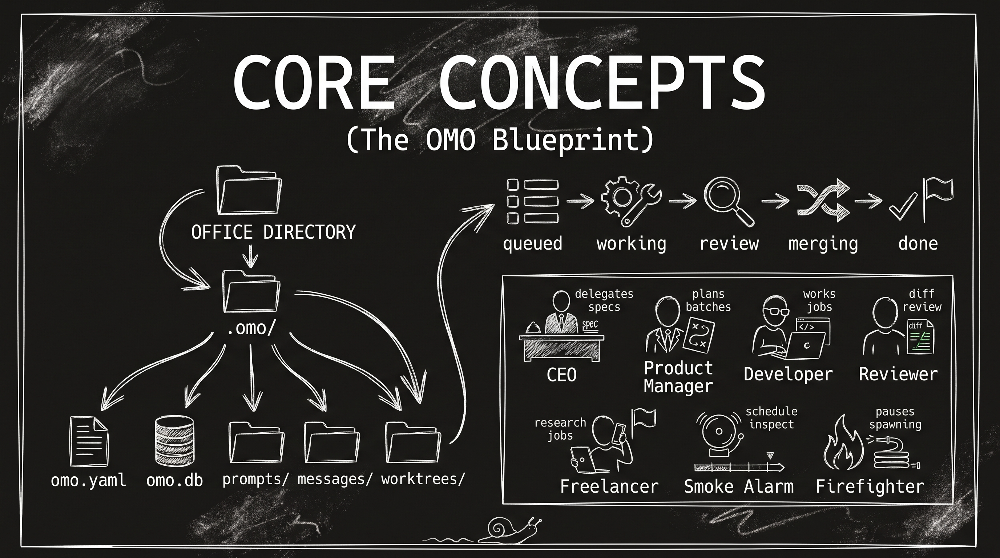

# one-man-office (omo)


Run a small company of AI CLI agents across one or more local Git repositories from a single terminal.

You talk to the **CEO**. The CEO writes specs and delegates them to **product managers**, who split the work into **developer** jobs. Each developer works in its own worktree and branch, and a **reviewer** checks the result before it merges. In parallel, a **smoke alarm** watches for stuck or unhealthy agents and can raise an incident for a **firefighter** to resolve.

`omo` is a single self-contained Go binary. It owns every agent PTY itself, so there is no tmux, daemon, or attach workflow. Closing `omo` stops the office, while the persistent job queue makes restarts cheap.

> [!NOTE]
> `omo` is fully functional, but it is still an early-stage project. Until version 1.0.0, behavior, configuration, commands, and compatibility may change or break between releases.

> [!WARNING]
> **Never run `omo` unattended.** By design, `omo` must launch agents in "unsafe" or unattended modes that do not pause for human approval before taking actions. This is **mostly** acceptable under active supervision, but combining these permissions with live web content creates a prompt-injection risk that can lead to destructive commands, data exposure, or other serious security incidents. Disable ordinary web access where possible. If web access is required, reserve it for the CEO or other higher-tier models that are more resistant - but not immune - to prompt injection. You assume all risks from using `omo`; the project and its maintainers are not liable for damages caused by `omo` or by the unattended permissions in its default configuration.


## Index

- [How the office works](#how-the-office-works)
- [Use omo when](#use-omo-when)
- [Install](#install)
- [Quick start](#quick-start)
- [Core concepts](#core-concepts)
- [Running omo](#running-omo)
- [The TUI](#the-tui)
- [Configuration](#configuration)
- [Complete CLI reference](#complete-cli-reference)
- [Customizing messages and prompts](#customizing-messages-and-prompts)
- [Logs](#logs)
- [Manual agent input](#manual-agent-input)
- [Testing](#testing)
- [License](#license)

## How the office works

```text
   o   o
   │   │
  [o m o] ◀─ the office binary, owns every agent PTY
   │   │
   │   └────────────────┐
   │                    │
┌─ you ─────────────────┴──────────────────────────────────┐
│ omo TUI  -  peek/type into any agent, read notifications │
└───────────────────────┬──────────────────────────────────┘
                        │
                      CEO ─────────────► freelancer   (one-off research/task)
                        │
                 product manager  (one per spec)
                        │
                    developer  (one per job, own worktree + branch)
                        │
                     reviewer  (clean context: goal + diff only) ──► merge

         smoke alarm (every 5m, fresh) ──► incident ──► firefighter
```

### Use omo when

- A substantial feature spans several components or repositories and benefits from parallel planning, implementation, review, and integration.
- You have a backlog of reasonably independent jobs that should keep moving with durable status, supervision, review cycles, and restart recovery.

### Prefer a normal single-agent session when

- The task is a small, focused fix or question, where orchestration would add more coordination and token cost than useful work.
- The work is highly exploratory and needs a tight conversation with you in one shared context, especially when conserving tokens is important.

## Install


### Linux and macOS

Quick install:

```bash
curl -fsSL https://raw.githubusercontent.com/scolastico-dev/one-man-office/main/install.sh | sh
```

Or download and inspect the script before running it:

```bash
curl -fsSLO https://raw.githubusercontent.com/scolastico-dev/one-man-office/main/install.sh
sh install.sh
```

### Windows PowerShell

Quick install:

```powershell
irm https://raw.githubusercontent.com/scolastico-dev/one-man-office/main/install.ps1 | iex
```

To inspect it first:

```powershell
Invoke-WebRequest https://raw.githubusercontent.com/scolastico-dev/one-man-office/main/install.ps1 -OutFile install.ps1
.\install.ps1
```

### What the installers do

The quick installers:

- Detect the operating system and CPU architecture.
- Verify the latest release checksum.
- Install `omo` into a user-owned directory.
- Add that directory to `PATH`.
- Safely keep the current release or update it when a newer release is available if you run the installer again.

Set `OMO_INSTALL_DIR` to choose a different installation directory. The defaults are:

- Linux/macOS: `~/.local/bin`
- Windows: `%LOCALAPPDATA%\Programs\omo`

Linux/macOS users may need to restart their shell after the first install. Windows users should open a new terminal so other processes see the updated user `PATH`.

Examples with a custom location:

```bash
OMO_INSTALL_DIR="$HOME/bin" sh install.sh
```

```powershell
$env:OMO_INSTALL_DIR = "$HOME\bin"
.\install.ps1
```

### Build and install from source

```bash
make install                  # -> /usr/local/bin/omo  (may need sudo)
make install PREFIX=~/.local  # -> ~/.local/bin/omo
```

`omo` must be on the `PATH` of the agents themselves because they invoke it by name to send mail, queue jobs, and report completion.

Other targets:

- `make build` -> `./bin/omo`
- `make test`
- `make check` -> fmt + vet + test
- `make cross` -> Linux/macOS/Windows, amd64 + arm64
- `make cross-linux`, `make cross-darwin`, `make cross-windows` -> one platform
- `make clean`
- `make help`

Requirements are Go >= 1.22 and `git`. The build is pure Go with `CGO_ENABLED=0` everywhere, including the SQLite driver. Linux, macOS, and Windows are supported on amd64 and arm64. Windows uses ConPTY and a named pipe; Linux/macOS use a PTY and Unix socket.

## Quick start


When creating an office, `omo setup` detects supported CLIs on `PATH` and selects the first one available in this order: Claude Code, Codex CLI, then Gemini CLI. Override the detected choice with `--agent-cli`:

```bash
omo setup
omo setup --agent-cli claude
omo setup --agent-cli codex
omo setup --agent-cli gemini
```

If none is found, setup preserves the historical Claude default and tells you what it chose. Detection and `--agent-cli` only affect a new office; setup never overwrites an existing `.omo/omo.yaml`. Run the chosen CLI once yourself first to complete its login.

### Bundled Superpowers

The provided role prompts require [Superpowers](https://github.com/obra/superpowers). `omo` installs a shared shallow checkout into `superpowers` inside its global home (`~/.local/omo` on Unix, `%APPDATA%/omo` on Windows) and fast-forwards it on every normal start. Prompts point agents at that checkout's `skills/<skill>/SKILL.md` files, so Claude, Codex, and Gemini do not need separate provider-specific Superpowers installations. If an update fails, omo warns and continues with the existing checkout when one is available. Earlier executable-adjacent `omo-superpowers` caches are left untouched and are no longer used.

`omo setup` supports two office shapes and detects which one you are using.

### Single repository

The office lives inside the project:

```bash
cd ~/workspace/acme/my-service
omo setup          # finds this repo, writes .omo/
omo --mock         # dry run on fake agents: no model calls
omo --safe-mode    # start only the CEO while debugging or changing rules
omo                # for real
```

`omo` adds `/.omo/` to the repository's `.git/info/exclude`, so its database, logs, and worktrees never show up in `git status` or in an agent's commit. Your `.gitignore` is not touched.

### Microservice landscape

The office is the parent directory containing multiple Git repositories:

```text
~/workspace/acme/          <- run omo here
├── api/                   <- a git repo
├── ui/                    <- a git repo
└── worker/                <- a git repo
```

```bash
cd ~/workspace/acme
omo setup          # finds api, ui and worker
omo --mock
omo
```

In either layout, check `repos:` in `.omo/omo.yaml` afterwards. That list defines what the CEO is allowed to work on. Use `omo repo list`, `omo repo add [name] <path>`, and `omo repo remove <name>` to update it quickly. Relative paths supplied to `add` are stored as absolute paths.

Then talk to the CEO. `omo` opens on the CEO's screen, and you describe what you want built. The CEO writes a spec, hands it to a product manager, and the work fans out into developer jobs. Each developer gets its own worktree, and every developer job is reviewed before it merges.

Cross-repository work is expressed as one job per repository. The CEO is told which repositories exist and is asked to pin the interface between services in the spec, so work such as a UI job can begin before the corresponding API job has merged.

## Core concepts



### The office

An **office** is a directory containing `.omo/omo.yaml`. It can be either a repository itself or a directory holding several repositories. Create one with `omo setup`, then run `omo` inside it. Several independent offices can exist side by side.

```bash
omo setup            # scaffold the current directory
omo setup my-office  # ...or a new one
omo setup --update   # replace messages, prompts, and bundled plugins
```

`omo setup` writes the config, the `.omo` layout, an initialized empty
database, editable message and role-prompt templates, and bundled plugins.

Once `.omo/omo.yaml` exists, ordinary `omo setup` preserves the office and only
creates missing extensions or bundled plugins. Use
`omo setup --update [dir]` to replace `.omo/messages`, `.omo/prompts`, and each
bundled plugin directory with the defaults from the installed `omo` version.
This discards edits and extra files in those embedded-asset directories, but
does not touch other plugins, the configuration, database, logs, worktrees,
socket metadata, or `.gitignore`. It refreshes the small embedded-generation
marker used by the boot check.

```text
my-office/
└── .omo/
    ├── .gitignore    # ignores every office file except itself
    ├── omo.yaml      # configuration
    ├── omo.db        # jobs, messages, agents, events, incidents (SQLite, WAL)
    ├── omo.sock      # Unix: link to a short socket under the temp directory
    ├── omo.lock      # live instance's socket or named-pipe endpoint
    ├── messages/     # what omo says to agents, editable
    ├── prompts/      # common + role instructions, editable
    ├── extensions/   # optional role-preset prompt additions
    ├── plugins/      # event-driven Lua and command plugins
    ├── storage/      # shared workspace/storage for CEO, PMs, smoke alarm, firefighter
    ├── worktrees/    # <repo>-<job-id>/ per developer job
    └── logs/         # one readable transcript per agent session
```

### Global home and office trust

`omo setup` and writable office startup initialize a user-wide home at
`~/.local/omo` on Linux/macOS or `%APPDATA%/omo` on Windows. Set `OMO_HOME` to
an absolute path to use a separate home, including for automated tests.

```text
omo/
  config.yaml    # independent global settings; never merged into office YAML
  config.lock    # serializes global configuration writes
  plugins/       # shared event plugins; initially empty
  extensions/    # shared role additions; initially empty
  template/      # new-office overlay; initially empty
  superpowers/   # downloaded shared skill checkout
```

The strict global `config.yaml` starts with:

```yaml
trusted_offices: []
plugins:
  update_on_start: true
  installed: {}
```

Before starting agents or performing startup updates, `omo` resolves the
office's absolute location and symlinks and asks whether you trust it. Accepting
adds that canonical location atomically to `trusted_offices`; declining or EOF
aborts startup. Approval applies to that location, not its children. Existing
offices also require approval on their first launch after upgrading. Headless
or piped input cannot silently approve an unknown office: use `omo --trust-office
--no-tui` to explicitly approve the current location and persist that choice.
Neither `--mock` nor `--skip-startup-checks` bypasses trust. Setup, read-only
observation, help/version, management, and agent commands do not prompt.

Put files in `template/` at their desired paths relative to a new office root.
For example, `template/.omo/omo.yaml` replaces the generated office config;
`template/.omo/prompts/developer.md` replaces that embedded role prompt; and
`template/notes/welcome.md` creates an ordinary office file. Fresh setup copies
all regular files recursively after exporting embedded defaults, replacing
matching paths and retaining file permissions. Symlinks and special files
are rejected before any office files are created. If copying later fails, setup
removes its initialization marker so correcting the filesystem problem and
rerunning setup completes the overlay; partially copied files can remain.
Repeating setup on an existing office and `omo setup --update`
both ignore the global template. There are no global `messages` or `prompts`
directories; the template is a copy source, not a runtime fallback.

Global `extensions/<role>.md` or `extensions/<role>/*.md` follow the same rules
as office extensions. Global content comes first, then office content; each
fragment directory is loaded lexically. Each scope independently requires
either the file or directory form, never both.

Global plugins use `plugins/<name>/plugin.json` and the same manifest and
configuration schema as local plugins. Configure managed Git sources under
the global `plugins.installed` mapping; unmanaged directories are also loaded.
The global `update_on_start` switch controls their startup updates independently
of the office switch. `--skip-startup-checks` skips both scopes' plugin updates.
Managed checkouts are cached in global `plugins/.repos`; plugin runtime/storage
data stays in each office's database. A local plugin directory or installed
configuration entry shadows the same global installation name, including a
disabled local entry. Selected hooks execute in lexical directory-name order
using their own scope's config. Duplicate manifest names across different
installation names fail startup. Global managed updates and startup loading
share a process-level file lock at `plugins/.update.lock`. Each running office
uses its own snapshot of the selected global plugin files, so updates affect
subsequent launches without changing an existing office's code or resources.
Snapshots live in the system temporary directory and are removed on orderly
office close; a forcibly terminated process may leave one for normal temporary
directory cleanup. Keep plugin durable data in the provided SQLite storage API.
`omo plugin` commands continue managing only
office-local plugins; edit global `config.yaml` to manage shared installations.

### Roles

| Role | Lifetime | What it does |
|---|---|---|
| **CEO** | the whole office | Talks to you, brainstorms, writes specs, delegates to PMs and freelancers, picks per-job models/policies, and can halt new work spawns. Never finishes or parks in `omo wait`. |
| **Product manager** | one spec | Plans modest rolling batches of developer jobs, selects allowed models, answers questions, judges review disputes, and performs a final integrated self-review. |
| **Developer** | one job | Works in a dedicated worktree on the configured job branch; uses TDD and focused tests for changed packages/direct dependents, commits, and never merges. |
| **Reviewer** | one review cycle | Gets only the goal and branch diff, then runs the full repository/end-to-end suite. It may commit a tiny unambiguous fix, but rejects substantive work. After rejection it remains for questions; a normal re-review replaces it. |
| **Freelancer** | one job plus follow-ups | Handles bounded research, information gathering, configs, simple work, and spec drafts. After reporting completion it stays parked for CEO follow-up questions; completed freelancers do not consume the active-job concurrency limit. Add `--repo` to give one an isolated worktree. |
| **Smoke alarm** | one round | On schedule, performs one short inspection of all agents together or one per alarm, with authoritative agent/job lifecycle state, published step, unread-mail count, and current/prior output tails, then exits with `omo done`. A parked `omo wait` session is explicitly distinguished from a stalled worker. It raises at most one incident; timed-out rounds restart, while rounds pause when an incident/firefighter is active. |
| **Firefighter** | one incident | Outranks the CEO: pauses spawning, kills/restarts agents, cancels/requeues jobs, then reports to you. |

Role prompts have embedded defaults, are exported into `.omo/prompts`, and point to the matching skills in omo's shared Superpowers checkout: brainstorming, writing-plans, executing-plans, TDD, and verification. Edit them per office in `.omo/prompts/<role>.md`.

Every prompt template receives `.Paths`, a deterministic list of `Label`,
`Path`, and `Description` values. Identical directories are emitted once with
their labels combined. The default common prompt renders references
for the office root, `.omo` directory, shared storage, the agent's actual
workspace, and each configured repository (`repo:<key>`). This lets customized
templates reference locations without hard-coding an office layout.

The CEO, product managers, smoke alarms, and firefighters run with
`.omo/storage` as their working directory. They may keep coordination artifacts
there without cluttering the office root. Developer and repository-scoped
freelancer sessions continue to use isolated Git worktrees.

### Plugins

Office-local plugins live in `.omo/plugins/<plugin-name>/`. Each directory has
a strict `plugin.json` manifest and the referenced Lua files:

```json
{
  "name": "example",
  "version": "1.0.0",
  "default_config": {
    "check_interval": "10m",
    "reminders": {"enabled": true, "after": "5m"}
  },
  "hooks": [
    {"event": "job_create", "lua": "decorate.lua", "timeout": "5s"},
    {"event": "agent_log_line", "command": ["node", "observe.mjs"]},
    {"event": "cron", "interval": "10m", "interval_config": "check_interval", "lua": "check.lua"}
  ]
}
```

Supported events are `job_create`, `agent_start`, `agent_log_line`, `manual`, and
`cron` (`chron` is accepted as an alias). A mutable `job_create` hook receives
`event.data` and may change the title, goal, model, or repository before normal
validation and persistence. Lua hooks use the global `event` table. Command
hooks receive the event as JSON on stdin; for a mutable event they return the
replacement data object as JSON on stdout. Stdout is a protocol channel rather
than a log stream: command plugins should write human-readable diagnostics and
progress messages to stderr, which omo records as the plugin log.

To make a plugin runnable on demand, add named `manual` hooks. Each manual hook
requires a `name` unique within that plugin and a non-empty `description`.
Names start with a letter or digit and use only letters, digits, `.`, `_`, or
`-`. Set `"manual_args": true` on an individual hook to let that action accept
optional arguments; it defaults to false:

```json
{
  "name": "report",
  "hooks": [
    {"event": "manual", "name": "weekly", "description": "Build a weekly report", "manual_args": true, "lua": "report.lua", "timeout": "30s"},
    {"event": "manual", "name": "reset", "description": "Clear saved report state", "lua": "reset.lua"}
  ]
}
```

From another terminal in the running office directory, use `omo plugin actions`
(or `omo plugin actions report`) to list enabled actions, their descriptions,
and argument support. Run `omo plugin trigger report reset`,
or `omo plugin trigger report weekly -- "two words" --verbose`.
Use the loaded manifest name shown in the Plugins tab. The plugin detail lists
the same action names and descriptions. Press `r` and, when multiple actions
exist, choose one with `↑`/`↓` and `Enter`. When its arguments are enabled, an
argument entry opens: quotes group words, `Enter` submits (including an empty
argument list), and `Esc` cancels. Read-only observers cannot trigger plugins.
Manual triggers are user-only; agent and plugin identities are rejected by the
server. Disabled plugins and plugins without manual hooks cannot be triggered.

Only the selected named hook runs, with its configured timeout. A second
manual action from the same plugin is rejected while its first run is active;
different plugins can run independently. Hooks receive `event.data.args` as an
ordered string array (a one-based Lua table), along with `plugin`, `action`,
`caller`, `request_id`, `at`, and `at_unix`. Arguments remain literal data;
omo does not append them to command
hook executables or evaluate them as shell commands. Command hooks receive
the same event as JSON on stdin.

The CLI waits for completion and returns hook errors; the TUI runs hooks in
the background and shows completion or failure in the detail view. A durable
`plugin_manual_requested` event precedes execution, followed by
`plugin_manual_completed` or `plugin_manual_failed`, linked by `request_id`.
These audit records identify the plugin and action; requests include the
argument count, never argument contents. Plugin-authored logs and errors can
still include their own input.
Office shutdown rejects new manual runs, cancels active hooks, and waits for
their outcome audits before closing the database. Command hooks and Lua
`omo.exec` allow one second for inherited output pipes to drain after command
exit or cancellation, preventing descendants from blocking shutdown indefinitely.
A request interrupted by a process crash is not automatically replayed after restart.

Each managed plugin may have an arbitrary `config` object in `omo.yaml`. Lua
hooks receive it as the global `config` table. Command hooks receive the same
object as JSON in `OMO_PLUGIN_CONFIG`; `OMO_PLUGIN_NAME`, `OMO_PLUGIN_EVENT`,
and `OMO_OFFICE_DIR` are also set. A cron hook can use `interval_config` to name
a top-level config field that overrides its manifest interval.

The optional manifest `default_config` must be a JSON object (omit it or use
`{}` for no defaults). `omo plugin install` copies its values into
`plugins.installed.<name>.config`. Plugin updates, including startup updates
and updates of disabled plugins, recursively add missing object keys. Existing
values always win, including `false`, zero, empty strings, arrays, and `null`;
arrays are never appended to and type conflicts are left intact. An absent
`config` receives the defaults, while an explicit `config: null` stays null.
Defaults removed from a later manifest do not delete stored config keys.

Config edits retain YAML comments, quoting, flow styles, and file permissions;
indentation may be normalized. Values inherited through YAML anchors remain
user-owned, with new defaults added locally. Invalid manifests or staging
failures leave the previous active plugin and config untouched. If writing
config fails after activation, omo rolls back the active plugin; the Git cache
may already contain the fetched revision. Unmanaged local directories are
loaded as before; their defaults are not written automatically.

Lua plugins can use `omo.local_get/set/delete/keys` for plugin-private durable
values, `omo.global_get/set/delete/keys` for a durable namespace shared by all
plugins, and `omo.exec(command, ...)` for an explicitly requested external
command. `omo.log(message)` publishes plugin log output in the Plugins TUI tab;
command plugins use stderr for the same purpose while stdout remains reserved
for mutable event JSON. Immutable command-hook stdout is discarded; mutable
command-hook stdout is limited to 64 KiB and must contain one complete JSON
object. The overview shows the latest log line, and the plugin detail page
provides timestamped, scrollable history. `plugins.log_lines`
retains the newest 500 lines per plugin by default and prunes older lines as new
output arrives. Command stderr is also captured through a bounded tail buffer.
`omo.duration(value)` converts values such as `500ms`, `5m`, or `1h`
to seconds while leaving numeric seconds unchanged. The optional `keys(prefix)`
argument returns matching keys in lexical
order so plugins can reconcile stale state. Values survive office restarts in
SQLite. The Lua runtime omits direct
filesystem and process libraries; both Lua and command hooks default to a
30-second timeout. Plugins are trusted office code—command hooks and
`omo.exec` run with the user's permissions.

Cron hooks also receive `event.data.agents`, a read-only lifecycle snapshot
with state, job state, published-step timestamps, and unread-mail counts.
Commands launched by `omo.exec` receive `OMO_OFFICE_DIR`, so an `omo send`
subprocess addresses the same running office while retaining the plugin as its
working directory.

Git-backed plugins are managed in `omo.yaml` and updated on startup:

```yaml
plugins:
  update_on_start: true
  installed:
    lint:
      source: https://github.com/acme/omo-plugins.git
      subpath: plugins/lint
      enabled: true
      config:
        check_interval: 10m
        severity: warning
```

Install a repository root with `omo plugin install <url>`, or select a plugin
inside a monorepo with `--subpath`. Missing `.git` URL suffixes are added
automatically for GitHub, Gitea, and other Git hosts. Managed checkouts and
active copies stay under `.omo/plugins`. Startup fast-forwards each configured
checkout and atomically refreshes its active copy; failures are warnings and do
not prevent the office from starting. `omo plugin disable` keeps both the
configuration and downloaded files while preventing hook loading.

The bundled `plugins/nudge` directory is both the default plugin and a working
example for plugin authors. The bundled `plugins/tools` directory provides
manual presets that ask the CEO to queue and delegate careful repository,
office-storage, security, dependency, and quality audits after active work.
Ordinary setup and startup install either missing bundled plugin without
overwriting an existing copy. `tools` is installed only when no local or global
plugin already owns that name; a config-less local `tools` directory is always
preserved. Its bundled ownership is recorded explicitly in `omo.yaml`, and
only that explicit `builtin:tools` entry lets `omo setup --update` replace the
directory. Their files participate in the embedded generation check;
interactive startup asks before `omo setup --update` replaces local edits with
a newer bundled version. Other plugin directories are never touched. The
configurable scheduler types reminders into agent
terminals for unread mail, stale work/status, `omo done`, and `omo wait`; it
does not create additional mail. All thresholds and repeat periods live under
`plugins.installed.nudge.config`. Disable either bundled plugin normally with
`omo plugin disable nudge` or `omo plugin disable tools`.

Run `omo plugin actions tools` to list the maintenance presets and
`omo plugin trigger tools <action>` to send one. Every preset asks the CEO to
inspect before deletion, preserve user work, and avoid destructive shortcuts.

### Jobs and merge lifecycle

Job states are:

`queued -> assigned -> working -> review -> merging -> done`

Additional states are:

- `rework`: reviewer rejected the job; the same worktree remains, with new findings.
- `failed`
- `cancelled`

`parent_job` records spec -> plan -> task lineage, and a PM's job ID is forced onto the developer jobs it creates, so lineage cannot be faked.

Every developer job names exactly one repository and gets a worktree at `.omo/worktrees/<repo>-<id>` on branch `<branches.prefix><id>` (default `omo/job-<id>`). A freelancer job can optionally name a repository and receives the same kind of isolated worktree for repository-scoped research or artifacts. Cancelled-job worktrees are removed after their agents stop; a completed freelancer keeps its worktree for follow-up questions until its retained session ends. Startup reconciliation removes terminal worktrees left by an interrupted shutdown. The mechanism is the same in both office layouts. Work spanning services becomes one developer job per repository.

Merges are serialized per repository. A conflicted merge is always aborted, so the repository is never left mid-merge, and the job is handed back to the reviewer to resolve in the worktree. On a successful merge, the developer is retired and the worktree and branch are removed.

`omo` never touches your Git signing configuration.

### Parallel work by design

The CEO or PM may pin probable interface contracts, such as likely API routes and types, so UI and API jobs can start together before either side is merged. Both job goals and review briefs should describe the contract as provisional.

Once both sides land, the PM queues a focused integration/alignment job for any mismatch. `omo` enforces concurrency caps internally, so PMs can maintain a modest rolling batch in the queue without serializing everything behind the first task or flooding the office with speculative work.

### Agent communication and durable state

Agents drive `omo` through the same binary. Their identity comes from the environment variables that `omo` injects: `OMO_AGENT_ID` and `OMO_SOCKET`.

Every agent verb round-trips through the local socket or pipe, and **every state change is committed to SQLite before the verb is acknowledged**. A crash between verbs therefore loses nothing.

When mail arrives for a running agent, `omo` types:

```text
You have new mail. Run: omo inbox
```

An agent parked in `omo wait` is released directly. Core sends only this immediate notification; repeated unread-mail and workflow reminders belong to the bundled nudge plugin and stop when that plugin is disabled.

#### Who may talk to whom

Routing is enforced by the server, not merely suggested in a prompt.

| Sender | May send to |
|---|---|
| developer | its own PM and current reviewer for clarification |
| product manager | CEO, its own developers/current reviewers, **other PMs** (the only lateral channel) |
| freelancer | CEO |
| reviewer | the reviewed job's developer and that job's PM |
| smoke alarm | incidents only |
| CEO, firefighter | anyone |
| agent contacted by a firefighter | that firefighter (direct reply only) |
| **everyone** | **the CEO, always (emergency channel)** |

Any agent may reply directly to a firefighter that first contacted it; this does not grant a general agent-to-firefighter channel. Agent-originated mail keeps the authenticated agent as sender, while supervisor-generated notifications use the distinct `omo` sender rather than impersonating the human user. PM-to-PM traffic volume is an input to the smoke alarm. Unusual lateral chatter makes it inspect those PMs more closely.

### Restart recovery

**Restart recovery is deliberately dumb.** On startup, every non-terminal job is requeued with a safety note that requires the agent to run `git status` before taking any action, identify and preserve all existing uncommitted changes, inspect message history, and avoid destructive cleanup such as `git checkout .` or `git reset --hard`.

Any incident left open by the previous process is automatically marked resolved during recovery. If the underlying problem persists, a later smoke-alarm round can file a fresh incident with current evidence.

A developer job that had already entered review receives a more specific note after recovery. It records that review was underway and asks the developer to perform a brief self-check and context alignment, then promptly call `omo done` to start a fresh review unless additional work is needed.

There is no transcript replay. Agents re-derive state from the worktree and their mail.

## Running omo

```bash
cd my-office
omo                 # opens the TUI, starting on the CEO's screen
omo --mock          # same org chart driven by scripted fake agents, no AI
omo --no-tui        # headless, for CI; Ctrl+C stops it
omo --read-only     # observe an existing office without locking or mutating it
```

`--mock` is the fastest way to see the whole machine work. It runs the full CEO -> PM -> developer -> reviewer -> merge chain with scripted fake agents and no model calls, using the first repository in your config.

`--read-only` opens a concurrent observer with Agents, Messages, Jobs,
Incidents, Events, and persisted Statistics tabs. It does not claim the office
lock, connect to the command socket, run recovery, spawn agents, mark messages
read, or expose management actions. When no owner is running, lifecycle rows
are an unmodified database snapshot and can therefore be stale. Read-only mode
cannot be combined with `--mock`, `--no-tui`, `--safe-mode`, or `--trust-office`.

### Browser supervisor

```bash
omo supervisor                          # http://127.0.0.1:8090
omo supervisor --max-agents 16          # aggregate cap across launched offices
omo supervisor --listen 127.0.0.1:0     # choose an available port
omo supervisor --mock                  # try offices with no model calls
```

Open the access URL printed in the terminal. The dashboard lists the offices in
the global `trusted_offices` setting. Add an existing office with **Load and
trust**, create a new office in a new absolute directory, or clone a Git
repository and scaffold it. Clone sources accept HTTPS, `ssh://`, or absolute
local repository paths; authentication uses your existing Git configuration and
SSH agent. Destination parents must already exist. Failed creation leaves the
new directory for inspection. Cloned `.omo` trees containing symlinks or special
files are rejected before setup, preventing writes outside that directory.
Other project symlinks are unaffected. Trust grants the office's configuration and
plugins permission to run commands as you.

Selecting a project starts a child `omo` and displays its live TUI through
embedded xterm.js. Selecting it again returns to the same running office.
**Open shell** starts an independent interactive `sh` on Unix or `cmd.exe` on
Windows, initially in that trusted project; use ordinary shell commands to work
elsewhere. The sidebar switches among live office and shell terminals. Closing
the browser keeps them running. **Estop** asks the office over its socket to
stop and clean up agents; **Force kill** terminates its owned process tree.
Exited terminals can be removed from the list. Up to 64 terminals and 16 browser
terminal connections may be retained at once.

`--max-agents` defaults to 12 and includes every role, including CEOs, reviewers,
safety agents, and branch namers. Each actual agent process holds a lease until
it exits; a dead office releases all remaining leases. Existing per-office
developer/freelancer limits still apply. If capacity is full, further spawns are
pending, including an office's initial CEO. Pending reviews take priority over
queued jobs. Under capacity pressure, a completed developer may be stopped to
make room for its reviewer; its branch and worktree remain intact, and rejected
work resumes with a fresh developer and the saved findings. Shells do not consume
agent capacity.
This cap covers offices launched by this supervisor process; independent `omo`
processes and other supervisors retain independent limits.

Children share one coalescing Claude/Codex usage cache by credential scope.
`--usage-cache-ttl` defaults to `10m`; child refresh requests respect that shared
freshness interval. Credentials are read by the parent and never sent through
the dashboard. Registered profile definitions are fixed for a child's lifetime;
reload rejects changed provider/credential identities and added or removed profile names
until the child is restarted. Other configuration changes can still reload.
On macOS, supervised Claude profiles require absolute non-empty
`CLAUDE_CONFIG_DIR` and `CLAUDE_SECURESTORAGE_CONFIG_DIR` overrides: resolving a
relative directory could select a different Keychain account. An explicitly
empty secure-storage override keeps its normal default-account meaning.
`usage.enabled: false` still disables provider checks for that office.
Children authenticate to a separate loopback listener using unique ephemeral
tokens. Loss of that channel fails closed: no further agent spawns or local
provider fallback, and a watchdog requests office/shell cleanup (normally within
one second, at most a five-second request timeout plus the next tick). Ctrl+C in
the supervisor stops its children, with forced cleanup after a bounded grace.
On Unix, forced cleanup snapshots descendant processes; deliberately daemonized
or reparented commands are outside that containment. Windows uses kill-on-close
Job Objects. This is a local terminal manager, not a process sandbox.

There are no accounts or login screen. The random access key in the printed URL
grants command execution with your permissions. It is removed from browser
history immediately and held only in page memory; use the original URL after a
reload. Keep it private. The server enforces Host/Origin and capability checks,
binds loopback by default, and warns when bound elsewhere. For remote access,
keep loopback binding and use an SSH port-forward with the same local and remote
port (for example `ssh -L 8090:127.0.0.1:8090 host`). Plain HTTP exposure is not
secure; forwarding-header-based reverse proxies are not supported. Browser
terminals use at most 256 KiB of replay per instance in server
memory and 2,000 lines of browser scrollback. The web supervisor never writes
terminal contents, input, or control tokens to disk; child offices retain their
normal `.omo/logs` behavior. Assets are embedded: `@xterm/xterm` 6.0.0 and
`@xterm/addon-fit` 0.11.0, with no CDN or Node.js runtime required.

### Startup checks

Before an interactive start, `omo` checks for:

- A newer release.
- Prompt, message, or bundled-plugin defaults from a newer embedded generation.

Separately, every normal start installs or fast-forwards omo's shared Superpowers checkout; `--skip-startup-checks` does not switch back to provider-specific plugin checks.

It asks before downloading a checksum-verified release or replacing editable
templates and bundled plugins with `omo setup --update`, then restarts itself.

Non-interactive/headless starts only print availability. They never accept on your behalf.

Disable individual checks under `startup`, or use `--skip-startup-checks` for
one invocation. Embedded-asset freshness uses `.omo/templates.sha256`, so
local edits are not mistaken for an old generation.

## The TUI

The TUI has two main surfaces.

### Peek

**Peek** is the home screen and starts on the CEO. It shows the selected agent's live terminal. Everything you type goes to that terminal, so talking to the CEO is simply using its session.


Controls:

- `Ctrl+O` or `Ctrl+Q` -> overview.
- `Ctrl+T` -> toggle read-only.
- `m` -> open a message composer for this agent while read-only.
- `Ctrl+O` is a macOS-safe alternative because a terminal-level `Cmd+Q` cannot be intercepted by a terminal application.

Peeking any agent other than the CEO opens read-only, so a stray keystroke cannot derail a working agent. Use `Ctrl+T` when you intentionally want to type to it. A message sent with `m` returns to the same read-only agent view.

Mouse-wheel events are forwarded to the nested CLI, so its conversation remains scrollable.

### Overview

**Overview** has nine tabs:

- Live agents, ordered as an indented spawn tree so parent/child relationships such as CEO -> PM -> developer -> reviewer stay together.
- Full office-message history, including read and inter-agent mail.
- All jobs.
- Smoke-alarm incidents, including resolved findings.
- The complete office event history.
- Current-session statistics.
- Installed plugin state, latest output, and scrollable retained log history.
- A command console that spawns a second `omo` CLI connected to the running
  office, captures its output in a persistent in-TUI log, and can run as the
  human user or impersonate any living agent under normal server permissions.
- A role prompt preview that accepts a prospective goal/input and renders the
  same editable common and role templates an agent would receive, including
  repository context for CEO and product-manager previews.

Statistics include separate current-session and all-time sections with messages, agent starts by role and model, review outcomes, and active/idle worker time per model. The Agents tab also shows the last successful weekly usage check for every metered model profile as an ASCII bar and percentage; these snapshots are persisted so read-only observers see the same values. CEO time is shown separately as an estimate based on whether its CLI transcript changes between one-second samples. All-time model totals are periodically upserted into `overall_statistics` (one row per model) and written once more during orderly shutdown.

| Agents | Statistics |
|---|---|
|  |  |
| Jobs | Messages |
|  |  |
| Incidents | Events |
|  |  |

Controls:

- `Tab` / `←` / `→` switch tabs.
- `↑` / `↓` select.
- `Enter` peeks the selected agent. In Messages, Jobs, Incidents, Events, and Plugins it opens the selected row in a full detail view. Plugin details offer `r` to trigger subscribed manual hooks, with argument entry when enabled. In Commands it opens the command console. In Preview it opens the role-input screen; enter a goal and press `Ctrl+P` to render the prompt.
- `x` reads a selected unread message addressed to the user.
- `x` opens a contextual management menu on Agents and Jobs. Available actions
  reflect current state: kill/restart a living agent, cancel active work, or
  requeue a failed/cancelled job.
- `m` opens a message composer for the selected agent, or for the agent associated with the selected message.
- `q` opens the quit dialog. Choose immediate quit, cancel, or `s` for a
  separately confirmed safe shutdown. Safe shutdown halts new spawns,
  broadcasts and injects a handoff request into every agent, then stops after
  every targeted agent finishes/checkpoints or the bounded deadline expires.
- `Ctrl+C` remains the immediate emergency stop.

Detail views preserve the complete message or record and scroll with `↑` / `↓`, `PgUp` / `PgDn`, `Home` / `End`, or the mouse wheel. `Enter`, `Esc`, `←`, or `q` returns to the table. Opening an unread user message marks it read. Durable history tables, including Jobs, show newest entries first.

The live agent peek refreshes at 10 Hz for responsive terminal output, while
overview/dialog modes refresh at 2 Hz and still repaint immediately for input.
Each overview render shares one data snapshot, and event history reads only
the visible page, so a long-running office does not repeatedly load its full
event table.

Controls appear in the footer only when they apply. Unread mail addressed to the user is pinned above other message history and shown as a footer indicator. Agent-view footers fill remaining width with as many active/total role counts as fit, starting with CEO and product managers.

The message composer uses `Tab` to switch between subject and body, `Enter` for body newlines, `Ctrl+S` to send, and `Esc` to cancel. Messages are sent as the human user with normal priority.

The Commands tab opens a guided operation browser. `↑`/`↓` chooses an operation,
`←`/`→` chooses the user or a living-agent identity, and `?` shows contextual
help. Forms label required inputs, show suggested values, validate them, and
build safely quoted commands. Operations that kill, cancel, remove, override,
or shut down require typing `yes` before execution. The final
`Advanced: raw command` item retains the original free-form runner for unusual
flags and future commands; subprocess execution still uses normal server-side
permissions for the selected identity and never invokes a shell. The console
reserves its upper half for the active operation and its lower half for command
history, keeping the latest command and output tail visible. User commands are
run here directly; agent prompts do not ask agents to act as command relays.

When automated terminal input is waiting, an injected-input marker appears in
the agent footer. If mail or `omo type` input arrives while you type into that
agent, `omo` waits for `input_debounce`, or for overview/read-only mode, before
inserting it. Queued `omo type` requests retain their order and keep text
separate from following special keys, including the delayed Enter used to
submit full-screen prompts safely. An inbox changing from empty to unread
inserts one notification; further messages remain durable without interrupting
another agent turn until that inbox has been cleared. Switching away may leave
partly composed text in the nested CLI. Compose long text elsewhere and paste
it into `omo` when ready.

Agents publish their current activity with `omo step "..."`. The Agents tab shows that description beside lifecycle state and job. Agents can inspect the same live view with `omo agent list`.

## Configuration

The main configuration lives in `.omo/omo.yaml`.

```yaml
repos:                        # local paths only
  api: /home/you/workspace/acme/api
  ui:  /home/you/workspace/acme/ui

models:                       # named runner profiles: just cmd + args + env
  claude-fable:
    provider: claude          # claude | codex | gemini; omit for custom CLIs
    cmd: claude
    args: ["--model", "fable", "--dangerously-skip-permissions"]
    env: {CLAUDE_CONFIG_DIR: /home/you/.claude-work}
    selectable: false         # the CEO may NOT choose this per job
  codex-astra:
    provider: codex
    cmd: codex
    args: ["--model", "gpt-6-astra", "--dangerously-bypass-approvals-and-sandbox"]
  opus:
    provider: claude
    cmd: claude
    args: ["--model", "opus", "--dangerously-skip-permissions"]
    env: {CLAUDE_CONFIG_DIR: /home/you/.claude-work}
  sonnet:
    provider: claude
    cmd: claude
    args: ["--model", "sonnet", "--dangerously-skip-permissions"]
    env:                       # passed only to this profile's CLI process
      CLAUDE_CONFIG_DIR: /home/you/.claude-personal
  haiku:
    provider: claude
    cmd: claude
    args: ["--model", "haiku", "--dangerously-skip-permissions"]
    env: {CLAUDE_CONFIG_DIR: /home/you/.claude-personal}

  # Custom delivery example. %prompt% substitution is explicit and remains
  # independent from automatic injection. Retries stop after `omo ready`.
  # custom:
  #   cmd: custom-agent
  #   args: ["--initial-prompt=%prompt%"]
  #   prompt_delay: 1s        # applies when launch args do not carry prompt
  #   inject_prompt: true
  #   prompt_retry_count: 3
  #   prompt_retry_wait: 30s

  # Alternative providers are examples only. Uncomment a complete profile
  # after installing its CLI, then assign the profile key to a role below.
  # codex-capable:
  #   provider: codex
  #   cmd: codex
  #   args: ["--model", "gpt-5.3-codex", "--dangerously-bypass-approvals-and-sandbox"]
  # codex-fast:
  #   provider: codex
  #   cmd: codex
  #   args: ["--model", "codex-mini-latest", "--dangerously-bypass-approvals-and-sandbox"]
  # gemini-auto:
  #   provider: gemini
  #   cmd: gemini
  #   args: ["--model", "auto", "--yolo"]
  # gemini-pro:
  #   provider: gemini
  #   cmd: gemini
  #   args: ["--model", "pro", "--yolo"]
  # gemini-fast:
  #   provider: gemini
  #   cmd: gemini
  #   args: ["--model", "flash", "--yolo"]
  # gemini-light:
  #   provider: gemini
  #   cmd: gemini
  #   args: ["--model", "flash-lite", "--yolo"]

roles:                        # all seven roles are required
  ceo:
    models: [claude-fable, codex-astra]
    assignment: failover      # Fable first; Astra when Fable is unavailable
  product_manager: opus
  developer:                 # strings remain valid for single-profile roles
    models: [sonnet, opus]
    assignment: round_robin  # round_robin | random | failover | smart
  reviewer: opus
  freelancer: sonnet
  smokealarm: haiku
  firefighter: opus

startup:
  check_self_update: true     # check the latest GitHub release on boot
  check_templates: true       # compare embedded template/plugin generation
  check_timeout: 5s

agents:
  ready_timeout: 2m           # handshake deadline
  start_prompt_delay: 2s     # fallback when a model has no prompt_delay
  max_spawn_retries: 2
  max_job_retries: 3
  lower_priority: true        # Linux: lower agent process priority
  nice_increment: 10          # added to inherited nice value, capped at 19

ceo:
  max_restarts: 3             # crash-loop protection
  restart_window: 30s
  restart_backoff: 500ms

limits:
  max_developers: 4           # concurrency caps
  max_freelancers: 2

branches:
  prefix: omo/job-             # generated branch prefix
  naming: generated            # generated | ai

usage:
  enabled: true               # false disables usage API calls and limits
  weekly_limit_percent: 90    # hard-stop ceiling for any watched window
  safe_shutdown_percent: 85   # stop spawning and request handoffs first
  refresh_interval: 10m       # proactive cache refresh; 0s disables scheduler
  claude_config_dirs:         # absolute Claude account configuration roots
    - /home/you/.claude-work
    - /home/you/.claude-personal
  codex_homes: []             # absolute CODEX_HOME account roots

smokealarm:
  enabled: true
  run_on_start: false
  mode: all                   # all | per_agent
  interval: 5m
  timeout: 2m                 # restart a round that does not finish
  tail_lines: 120             # how much recent output each round sees
  history_runs: 3             # prior tails included for comparison
  include_events: true
  include_pm_chatter: true

logs:                         # session transcripts in .omo/logs
  max_size_kb: 2048           # rotate the live log at this size
  keep: 50                    # completed sessions; live ones don't count

reviews:
  escalate_after: 2           # PM judges repeated rejection

notifications:
  input_debounce: 30s         # don't inject mail/type input while typing; 0s disables

plugins:
  update_on_start: true        # fast-forward managed Git plugins on boot
  log_lines: 500               # retained history lines per plugin; must be positive
  installed:
    nudge:                     # bundled workflow-reminder/example plugin
      source: builtin:nudge
      enabled: true
      config:
        check_interval: 1m
        activity_sample_interval: 30s
        reminders:
          inbox: {after: 5m, repeat: 15m}
          smokealarm_done: {after: 5m, repeat: 10m}
          park_completed: {after: 2m, repeat: 15m}
          reviewer_wait: {after: 5m, repeat: 15m}
          no_job_wait: {after: 15m, repeat: 30m}
          stale_work: {after: 15m, repeat: 30m}
    tools:                     # bundled CEO maintenance-action presets
      source: builtin:tools
      enabled: true

cleanup:                      # retention scheduler; 0 disables each rule
  interval: 1h
  read_messages_after: 0s     # delete mail this long after it is read
  terminal_jobs_after: 0s     # delete safe done/failed/cancelled leaf jobs
  storage_active_days: 60     # per-file age; shutdown days do not count
  max_entries:                # oldest safe rows; 0 disables each table cap
    agents: 10000
    jobs: 10000
    messages: 50000
    events: 100000
    incidents: 10000
    overall_statistics: 1000
    shutdown_contexts: 1000
    model_usage_snapshots: 100

# Satisfy supported CLIs' workspace and plugin trust gates for each agent
# working directory. Agents have nobody to answer interactive trust dialogs.
trust_workdirs: true
```

When `omo` loads an older valid config, it writes back any missing built-in keys with their defaults while preserving configured values and comments. Unknown keys remain errors, so typos still fail loudly.

While the office is running, `omo reload` validates `.omo/omo.yaml` and atomically applies it to subsequent scheduling, spawning, and completion work without killing existing agents. It can be run by the user from the active office directory or by the CEO/firefighter inside their sessions. Existing processes keep the command line, environment, prompt, and worktree they started with.

Storage cleanup is enabled by default and deletes each `.omo/storage` file after 60 distinct office-active days since that file's last modification. Activity comes from event timestamps, so days while omo is shut down do not count; set `storage_active_days: 0` to disable it. Agents receive the configured policy in their common prompt so they can move durable deliverables into a repository workspace.

The same scheduler caps durable SQLite history with conservative defaults under `cleanup.max_entries`; set an individual table to `0` to disable its cap. Plugin log history is bounded separately and synchronously by `plugins.log_lines`. Caps delete the oldest safe rows first. Living agents, unread mail, open incidents, non-terminal jobs, job lineage with retained children, and storage-retention event-day anchors are protected, so a table can temporarily remain above its configured cap when protected rows alone exceed it. Cleanup runs once when the office starts and then at `cleanup.interval`.

`branches.naming: generated` appends the numeric job ID to `branches.prefix`. In `ai` mode, omo starts a short-lived branch-naming agent with the job brief; it returns a complete Conventional Commits-style branch name such as `feat/add-search` or `fix/login-timeout`. AI names do not use `branches.prefix`, so branches are grouped by their top-level change type. The naming instructions are customizable in `.omo/messages/branch_naming_goal.txt`, like the other supervisor-generated prompts.

### Model profiles

`omo` has no concept of a "model". A profile is simply a command line. Set `provider: claude`, `provider: codex`, or `provider: gemini` to enable that CLI's startup adapter; direct commands with those names are also detected automatically.

Model profiles can control initial-prompt delivery. Every `%prompt%` substring in `args` is replaced before launch. This explicit argument substitution is independent from `inject_prompt`: setting `inject_prompt: false` disables automatic provider/PTY delivery without disabling `%prompt%`. For PTY delivery, `prompt_delay` overrides the global `agents.start_prompt_delay`. When automatic injection is enabled, omo resends the prompt if the agent has not called `omo ready` within `prompt_retry_wait`; `prompt_retry_count` is the number of additional sends, defaults to `3`, and may be set to `0` for the previous one-shot behavior. The retry wait defaults to `30s`.

A role may name one profile as before, use a bare profile list (which defaults to `round_robin`), or configure `models` and `assignment`. `round_robin` rotates through eligible profiles, `random` chooses among them, and `failover` advances from the retry position. Repeated list entries are intentional weights: `models: [model-a, model-a, model-b]` gives `model-b` one third of random selections. `smart` chooses the first profile with the most capacity remaining, with configuration order breaking ties. Smart roles support Claude and Codex profiles.

When usage checks are enabled, omo reads the native Claude Code and Codex OAuth credentials and calls their usage APIs at startup. This preflight is strict, including with `--skip-startup-checks`; missing credentials or unavailable usage data stops startup before the office lock, database, recovery, or CEO spawn. Usage is account-scoped rather than model-scoped: definitions sharing one credential scope reuse the same request and resolve to only Claude weekly, Claude session, and Codex weekly windows. Set `usage.claude_config_dirs` and `usage.codex_homes` to the absolute credential roots omo may use. A single configured root is applied automatically to matching profiles. With multiple roots, each matching model profile must select one through `env.CLAUDE_CONFIG_DIR` or `env.CODEX_HOME`; those environment variables are also passed to the CLI, so profiles can use separate accounts. For Claude, omo mirrors the selected root into `CLAUDE_SECURESTORAGE_CONFIG_DIR` so current Claude Code releases use the same account for filesystem and macOS Keychain credentials. Successful responses are cached, and simultaneous cache misses are coalesced into one provider request. The scheduler refreshes each credential scope at `usage.refresh_interval` (default ten minutes); `0s` disables proactive refresh while retaining lazy cache refresh. A runtime refresh failure falls back to round-robin for that spawn and sends one user warning per consecutive failure streak. The TUI keeps a separate usage row for each credential root.

Metered profiles at or above `usage.safe_shutdown_percent` in any watched window are excluded from assignment. If a role has no eligible candidate, omo reports that role as blocked. Safe shutdown begins only when every configured Claude/Codex credential scope reaches the soft threshold; a capped Claude role does not stop an office that still has Codex capacity, or vice versa. If every scope reaches `usage.weekly_limit_percent` before handoffs finish, omo stops immediately. After the TUI restores the terminal, omo prints the usage reason for either exit to stdout. An explicit per-job `--model` is rejected at the soft threshold with its current percentage and window plus instructions to rerun with `--force`; the force approval is persisted for that job and does not affect child jobs. Set `usage.enabled: false` to disable usage API calls and enforcement entirely; `smart` assignment then falls back to round-robin.

The CEO may pick any profile per job with `--model <key>` unless it is marked `selectable: false`. A role can **run on** a profile it is forbidden to **spawn**.

PMs use the same `--model` flag when creating developer jobs. When creating a PM job, the CEO can independently constrain its developers with `--developer-models sonnet,haiku` or force one profile with `--force-developer-model sonnet`. Neither option changes the PM's own model.

The configuration example above keeps the non-CEO roles Claude-only for brevity. Actual setup automatically activates the first installed CLI in Claude → Codex → Gemini priority order, unless `--agent-cli` overrides it. A Claude-generated configuration starts the CEO with Fable and falls back to Codex Astra when Fable is unavailable; its remaining concrete Codex profiles are available for role assignment. Codex- and Gemini-generated configurations activate one account-default profile for the selected CLI and leave the concrete alternatives commented, avoiding an assumption about model access or spending tier.

The included examples use `gpt-6-astra` as the CEO's Codex failover, `gpt-5.3-codex` for capable Codex work, and `codex-mini-latest` for faster Codex work. Gemini CLI's `auto` alias is the safest general default, while `pro`, `flash`, and `flash-lite` trade capability for progressively faster or lighter work. Model availability still depends on the CLI version and account.

```yaml
models:
  # codex-capable:
  #   provider: codex
  #   cmd: codex
  #   args: ["--model", "gpt-5.3-codex", "--dangerously-bypass-approvals-and-sandbox"]
  # codex-fast:
  #   provider: codex
  #   cmd: codex
  #   args: ["--model", "codex-mini-latest", "--dangerously-bypass-approvals-and-sandbox"]
  # gemini-auto:
  #   provider: gemini
  #   cmd: gemini
  #   args: ["--model", "auto", "--yolo"]
  # gemini-pro:
  #   provider: gemini
  #   cmd: gemini
  #   args: ["--model", "pro", "--yolo"]
  # gemini-fast:
  #   provider: gemini
  #   cmd: gemini
  #   args: ["--model", "flash", "--yolo"]
  # gemini-light:
  #   provider: gemini
  #   cmd: gemini
  #   args: ["--model", "flash-lite", "--yolo"]
```

The unattended flags grant agents broad access to the worktree. Review the generated config and use only repositories you are prepared to let the selected CLI modify.

> ⚠️ **Regarding Gemini usage**: We’ve found that Gemini can be prone to context drift, and its pricing is generally less competitive than Claude or Codex. In addition, even with a Gemini subscription, the billing model is per request rather than token-based, which means the frequent request pattern used by omo can add up quickly. For these reasons, we recommend using Claude or Codex instead of Gemini.

### Recommended model choices

For the most reliable setup, we recommend a Claude Team Premium seat together with ChatGPT Plus or Pro. In practice, that combination roughly matches the usage limits of this office pattern: with a few concurrent agents and active work across a normal week, we saw around 20–30 hours of useful active work before both subscriptions reset, which is a very reasonable fit for a full work week. The config above is tuned to take advantage of the strongest models for the right task, while still letting you intentionally fall back to lower-end models when budget or speed matters. This is the setup that has proven to work well in practice, but it is not the only valid configuration.

```yml
models:
  claude-fable:
    provider: claude
    cmd: claude
    args: ["--model", "fable", "--dangerously-skip-permissions"]
    selectable: false
  codex-astra:
    provider: codex
    cmd: codex
    args: ["--model", "gpt-6-astra", "--dangerously-bypass-approvals-and-sandbox"]
  claude-opus:
    provider: claude
    cmd: claude
    args: ["--model", "opus", "--dangerously-skip-permissions"]
  claude-sonnet:
    provider: claude
    cmd: claude
    args: ["--model", "sonnet", "--dangerously-skip-permissions"]
  claude-haiku:
    provider: claude
    cmd: claude
    args: ["--model", "haiku", "--dangerously-skip-permissions"]
  codex-sol:
    provider: codex
    cmd: codex
    args: ["--model", "gpt-5.6-sol", "--dangerously-bypass-approvals-and-sandbox"]
  codex-luna:
    provider: codex
    cmd: codex
    args: ["--model", "gpt-5.6-luna", "--dangerously-bypass-approvals-and-sandbox"]
  codex-mini:
    provider: codex
    cmd: codex
    args: ["--model", "gpt-5.4-mini", "--dangerously-bypass-approvals-and-sandbox"]
roles:
  ceo:
    models: [claude-fable, codex-astra]
    assignment: failover
  product_manager:
    models: [claude-opus, codex-sol]
    assignment: smart
  developer:
    models: [claude-sonnet, codex-luna]
    assignment: smart
  reviewer:
    models: [claude-opus, codex-sol]
    assignment: random
  freelancer:
    models: [claude-sonnet, codex-luna]
    assignment: smart
  smokealarm:
    models: [claude-haiku, codex-mini]
    assignment: failover
  firefighter: claude-opus
```

### Token usage

`omo` is effective, but it is not token-efficient. Running several agents can burn through tokens quickly.

Usage depends on your chosen CLI, account, models, task, and concurrency. Configure `usage.safe_shutdown_percent` (default `85`) for orderly handoffs and `usage.weekly_limit_percent` (default `90`) for the hard ceiling; use `assignment: smart` to prefer the eligible Claude/Codex profile with the most capacity left. Set `usage.enabled: false` when omo must not call provider usage APIs or enforce either threshold.

### Socket behavior

On Unix, the real socket is created under the system temporary directory and `.omo/omo.sock` links to it. This avoids the kernel's roughly 103-byte socket-path limit for deeply nested offices.

Windows uses an office-specific named pipe and does not create a socket file.

While an office is live, `.omo/omo.lock` records that real socket or named-pipe endpoint. A second `omo` validates the endpoint and offers to emergency-stop the existing session before starting; stale locks are discarded. `omo estop` sends the same shutdown request directly from the office directory.

### Provider startup and folder trust

Supported CLIs receive the initial `omo ready` instruction in the way their interactive UI handles reliably:

- Claude Code receives a delayed PTY submission. `omo` records per-directory consent in `~/.claude.json` while preserving every unrelated setting.
- Codex receives the prompt as its initial positional argument. A per-launch config override trusts the exact workdir, and `TERM` is normalized for the PTY so no pre-prompt confirmation appears.
- Gemini receives `--prompt-interactive`, keeping the session open after its initial task. Workspace trust is granted only for that process through `GEMINI_CLI_TRUST_WORKSPACE=true`.

Set `trust_workdirs: false` to manage these trust gates yourself. With trust automation disabled, a fresh worktree may block before the agent sees its start prompt. Claude is the only adapter that directly edits a trust file.

### Safe mode

Start with `omo --safe-mode` when you want to debug the office or provision
new agent rules before normal work begins. The CEO starts with an explicit
safe-mode instruction, while product managers, developers, reviewers,
freelancers, smoke alarms, and firefighters remain blocked from spawning.
Queued work is preserved. After discussing the change with the CEO, either
the user from the office directory or the CEO can run
`omo office resume-spawns` to exit safe mode and boot the full office.

## Complete CLI reference

There are two kinds of command:

- **Standalone commands** work in your normal shell.
- **Live-office commands** use `OMO_AGENT_ID` and `OMO_SOCKET` inside agent terminals. When run from the active office directory without those variables, supported inspection and management commands connect as the reserved `user` identity. Every caller remains subject to server-enforced role permissions.

A human can issue a shared command by peeking that agent in the TUI, enabling input with `Ctrl+T` when necessary, and typing the command there.

Every command accepts `-h` / `--help`. `omo help [command]` shows the same command help, and `omo -v` / `omo --version` prints the installed version.

### Commands for the user

These are the normal entry points expected to be run directly from your shell.

| Command | Arguments and flags | Purpose |
|---|---|---|
| `omo` | `--mock`, `--no-tui`, `--safe-mode`, `--skip-startup-checks`, `--read-only` | Start the office. `--mock` uses scripted agents; `--no-tui` runs headless until `Ctrl+C`; `--safe-mode` starts only the CEO until spawning is resumed; `--skip-startup-checks` suppresses release/embedded-asset checks once. `--read-only` opens a non-mutating concurrent observer and is incompatible with the three mutating startup modes. |
| `omo setup [dir]` | Optional destination directory; defaults to `.`. `--agent-cli auto\|claude\|codex\|gemini` overrides automatic CLI selection. | Create a new office. Auto-detection prefers Claude, then Codex, then Gemini. Does nothing if `.omo/omo.yaml` already exists. |
| `omo supervisor` | `--listen 127.0.0.1:8090`, `--max-agents 12`, `--usage-cache-ttl 10m`, `--mock` | Open a local browser control plane for trusted offices, live TUI terminals, and interactive shells. The printed access URL grants command execution. |
| `omo setup --update [dir]` | Optional existing office directory; defaults to `.` | Replace `.omo/messages`, `.omo/prompts`, and bundled plugin directories with this binary's defaults, then refresh the generation marker. |
| `omo repo list` | None | List repository names and absolute paths from `.omo/omo.yaml`. |
| `omo repo add [name] <path>` | A Git checkout; name defaults to its directory name | Add a repository or update an existing entry. Relative paths are normalized to absolute paths. |
| `omo repo remove <name>` | A configured repository name | Remove a repository from the office configuration. |
| `omo plugin list` | None | List Git-backed plugins and enabled state. |
| `omo plugin actions [plugin]` | Optional loaded manifest name | List enabled manual action names, descriptions, and argument support in the running office. |
| `omo plugin trigger <plugin> <action> [-- <args>...]` | Loaded manifest and action names; arguments require `manual_args: true` on the selected hook | User-only: run the named manual action and wait for completion. Run from the office directory. |
| `omo plugin install <url>` | Optional `--name` and `--subpath` | Clone a plugin into `.omo/plugins` and add an enabled entry with manifest defaults to `omo.yaml`. |
| `omo plugin update [name]` | Optional configured plugin name | Fast-forward one plugin or all managed plugins, refresh active copies, and add missing manifest config defaults. |
| `omo plugin enable <name>` / `disable <name>` | A configured plugin name | Toggle loading on the next office start without deleting configuration or files. |
| `omo completion <shell>` | Shell is `bash`, `fish`, `powershell`, or `zsh`; each accepts `--no-descriptions` | Print a shell-completion script to standard output. |
| `omo --help` | Also `omo <command> --help` | Show the command tree or help for one command. |
| `omo --version` | Short form: `-v` | Print the `omo` version. |

### Commands for both the user and agents

These inspect or operate a running office. A human may run them directly from the active office directory; agents use the injected office connection. Permission notes are enforced by the supervisor, regardless of who is typing.

| Command | Arguments and flags | Purpose / permission |
|---|---|---|
| `omo office pause` | None | Pause spawning new agents. Available to the user, CEO, and firefighter. |
| `omo office resume` | None | Resume spawning. Available to the user, CEO, and firefighter. |
| `omo office halt-spawns` | None | Halt new work-agent spawns. Available to the user, CEO, and firefighter; queued work and smoke/fire safety monitoring remain active. |
| `omo office resume-spawns` | None | Resume new work-agent spawns. Available to the user, CEO, and firefighter; if safe mode is active, this also exits safe mode and boots the full office. |
| `omo agent list` | None | List all living agents with role, lifecycle state, job, and published step. |
| `omo type <agent-name> [text]` | Optional `--key` values may be repeated or comma-separated | Send literal text and/or special keys to an active agent terminal. Available to the user from the running office directory, the CEO, the firefighter, and trusted plugins under the reserved system identity. Text does not imply Enter; add `--key enter` when submission is required. Input targeting the agent in a writable TUI peek waits behind recent human typing; other targets and read-only/overview views deliver immediately. |
| `omo agent kill <name-or-role>` | Exact agent name or role | Permanently stop matching agents and cancel their active work. Available to the user, CEO, and firefighter. |
| `omo estop` | None | Immediately stop the office. Available to the user, CEO, and firefighter. |
| `omo safe-shutdown` | None | Halt spawning, ask every agent to finish only when near done or save a concise durable handoff, then stop. Available to the user, CEO, and firefighter. |
| `omo agent restart <name-or-role>` | Exact agent name or role | Replace matching agent processes without requeueing their jobs or incrementing retries. Available to the user, CEO, and firefighter. |
| `omo job list` | None | List jobs visible in the office queue. |
| `omo job show <id>` | Numeric job ID | Show the complete stored job. |
| `omo job cancel <id>` | Numeric job ID | Cancel a job. Available to the user, CEO, and firefighter. |
| `omo job requeue <id>` | Numeric job ID | Requeue a failed or cancelled job. Available to the user, CEO, and firefighter. |
| `omo inbox` | None | List unread mail for the current agent identity. |
| `omo read <id>` | Numeric message ID | Show one message and mark it read. |
| `omo send [body]` | `-s` / `--subject` required; `-t` / `--to` target; `-p` / `--priority` is `low`, `normal`, `high`, or `urgent` (default `normal`) | Send mail as the current agent. Omit `--to` to broadcast; omit the body argument to read it from stdin. Normal mail-routing rules apply. |

### Commands mostly for agents

These drive the orchestration protocol and are normally generated by role prompts rather than typed by the user.

| Command | Arguments and flags | Purpose / permission |
|---|---|---|
| `omo ready` | None | Report that the process is alive and print its common prompt, role prompt, and goal. |
| `omo step "<current status>"` | One non-empty description, at most 500 characters | Publish the agent's current activity to `omo agent list` and the TUI. Quote descriptions containing spaces. |
| `omo done [result]` | Optional single result argument | Report goal completion. Quote a multi-word result. The CEO cannot finish. A freelancer's first completion closes the job but retains its session for follow-up mail. |
| `omo context save [summary]` | One concise summary argument, `-f`/`--file <path>`, or stdin; maximum 8000 characters | During safe shutdown, persist completed work, remaining work, blockers, and the exact next step. The matching role/job receives it on the next office run, after which it is deleted. |
| `omo wait` | Optional `--timeout <duration>` such as `30s` or `5m` | Park until mail, a supervisor release, or the optional timeout. Zero or an omitted timeout waits indefinitely. The CEO and smoke alarms cannot wait; smoke alarms finish checking/reporting with `omo done`. |
| `omo reload` | None | Validate and reload `.omo/omo.yaml` in the running office without killing current agents. Available to the user from the office directory, the CEO, and the firefighter. |
| `omo logs <developer-name>` | Optional `-n` / `--lines` (default `100`, maximum `10000`) | Print the latest readable transcript lines for an active developer. Available to the user from the running office directory, the CEO, and the firefighter. |
| `omo job create` | `--title` and `--role` required; exactly one of `--goal <text>` or `--goal-file <path>`; optional `--model`, `--force`, `--repo`, `--parent`, `--developer-models`, `--force-developer-model` | Queue a `product_manager`, `developer`, or `freelancer` job. `--force` permits only that explicit `--model` above the weekly ceiling. `--goal-file` copies the file contents into SQLite. `--repo` is required for developer jobs and optional for freelancer worktrees. Available to the user and CEO; PMs may create developer jobs under their enforced model policy. |
| `omo job verdict <id> <merge\|reject>` | Optional `--notes`; required when rejecting | Submit a review verdict. Reviewer identity required. |
| `omo job override <id>` | `--notes` required | Have the owning PM overrule an out-of-scope or nitpicking rejection and direct the retained reviewer to merge. |
| `omo incident create` | `--agent` and `--class` required; optional `--detail`. Class: `stuck`, `looping`, `drifting`, `too-slow`, or `other` | File an incident and request a firefighter. Smoke-alarm or firefighter identity required. |
| `omo incident resolve <id>` | `--report` required | Resolve an incident and send its report to the user. Available to the user, CEO, and firefighter. |

`omo fake-agent [--scenario <file>] [--auto-role <role>]` is a hidden internal test command used by `--mock` and the integration suite. It is not part of the normal user or agent workflow.

## Customizing messages and prompts

Every line that `omo` itself puts in front of an agent is a template in `.omo/messages`, rendered with Go `text/template`.

| File | When | Placeholders |
|---|---|---|
| `start_prompt.txt` | typed into a fresh session | `.Name` |
| `mail_nudge.txt` | typed when mail arrives | none |
| `restart_note.txt` | appended to a requeued job's goal | none |
| `restart_review_note.txt` | appended when a job that was already in review is requeued after restart | none |
| `ceo_goal.txt` | the CEO's standing goal | none |
| `review_goal.txt` | the reviewer's clean-context briefing | `.JobID` `.Title` `.Goal` `.Branch` `.Diff` |
| `firefighter_goal.txt` | the incident briefing | `.ID` `.Agent` `.Class` `.Detail` `.Snapshot` |
| `smokealarm_goal.txt` | the inspection round's input | `.Report` |
| `spawn_failed.txt` | agent never started | `.Name` `.Role` `.Attempts` |
| `job_failed.txt` | job exceeded its retries | `.JobID` `.Title` `.Count` |
| `review_failed.txt` | reviewers kept dying | `.JobID` `.Count` |
| `review_escalated.txt` | consecutive rejects reached the PM threshold | `.JobID` `.Count` |
| `ceo_gave_up.txt` | `omo` stopped respawning the CEO | `.Count` `.Window` |
| `review_override.txt` | PM overrules a rejection and directs merge | `.JobID` `.Notes` |

Edit a file to change what `omo` says. Delete it to fall back to the built-in default. A malformed template fails at startup rather than silently reverting.

Keep the `INCIDENT_ID: {{.ID}}` line in `firefighter_goal.txt`. The resolve flow parses it back out.

`omo setup` also exports `.omo/prompts/common.md` and one `<role>.md` file per role. `omo` reads them at startup and falls back to embedded defaults only for missing files.

Ordinary setup leaves an existing office alone. Use `omo setup --update` when
you intentionally want to reset editable template and bundled-plugin
directories to the installed defaults.

Prompt extensions live in `.omo/extensions`. For a role preset, use either one
file named `<role>.md` or a directory named `<role>/` containing Markdown
fragments. Directory fragments load in lexicographical filename order;
non-Markdown files are ignored, and defining both forms is an error. The
loaded text is available to templates as `{{.Extensions}}`, and the default
common prompt includes it under `PROMPT EXTENSIONS`. `omo setup` and
`omo setup --update` create the extension directory but never delete its
contents.

Startup freshness checking can be disabled with `startup.check_templates: false`.

## Logs

Each spawn gets its own transcript at:

```text
.omo/logs/yyyy-mm-dd_hh-mm-<role>-<name>.log
```

The directory therefore sorts chronologically.

`omo` interprets the full-screen terminal and writes changed screen lines, so logs are readable line-oriented text instead of concatenated cursor redraws. Recent lines are deduplicated even when the CLI moves them to a different row. Transient spinners, empty prompts, separators, and status-bar chrome are omitted.

Large live sessions rotate into `.log.1`, `.log.2`, and so on.

The user, CEO, and firefighter can inspect a living developer without opening its TUI session by running `omo logs <developer-name> -n <lines>`.

`logs.keep` counts completed session groups across the office. Living agents are excluded, so `keep: 10` can leave more than ten groups while agents are active.

- Default: `50`
- `0`: remove completed logs
- `-1`: disable inactive log pruning

Every rotated segment belonging to a retained session stays with that session.

## Manual agent input

The user, CEO, and firefighter can answer an interactive confirmation or menu without restarting an agent and losing its context. Send literal text, named keys, or both in order:

```bash
omo type developer-ada "yes" --key enter
omo type developer-ada "1" --key enter
omo type developer-ada --key down,down,enter
omo type developer-ada --key ctrl+c
```

Supported named keys are `enter`/`return`, `tab`, `space`, `escape`/`esc`, `backspace`, `delete`, arrow keys, `home`, `end`, page up/down aliases, and `ctrl+a` through `ctrl+z`. Inspect the agent output first and send only the minimum input required; arbitrary terminal input has the same power as typing directly into that agent in the TUI.

## Testing

The kernel is fully testable without any AI. A scenario-driven fake agent, `omo fake-agent`, stands in for the CLI, and the integration tests spawn it in real PTYs/ConPTYs to exercise:

- spawn -> queue -> review -> merge
- smoke alarm -> firefighter
- restart recovery

```bash
make test
```

Real CLI handshakes are opt-in because they make a model request. Each command disables spawn retries and tests only `omo ready`:

```bash
OMO_LIVE_AGENT_CLI=codex go test ./internal/supervisor -run TestLiveAgentCLIHandshake -count=1
OMO_LIVE_AGENT_CLI=gemini go test ./internal/supervisor -run TestLiveAgentCLIHandshake -count=1
```

## License

Copyright (C) 2026 Joschua Becker EDV.

Licensed under the [GNU Affero General Public License v3.0 or later](LICENSE).
