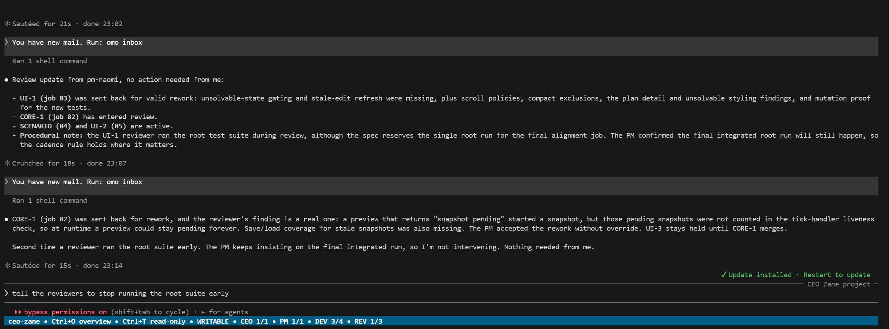
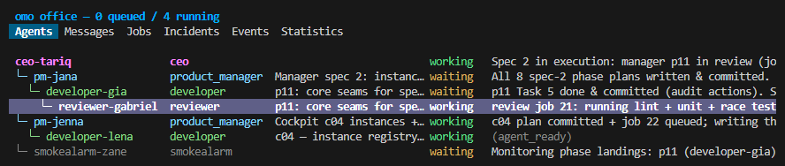
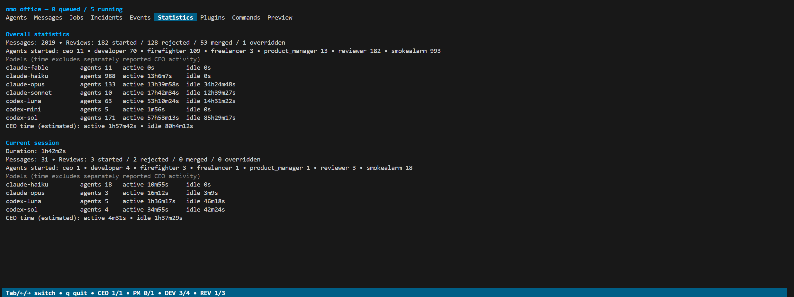
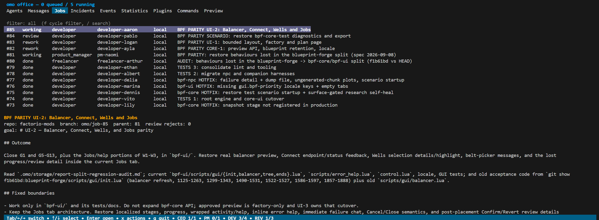
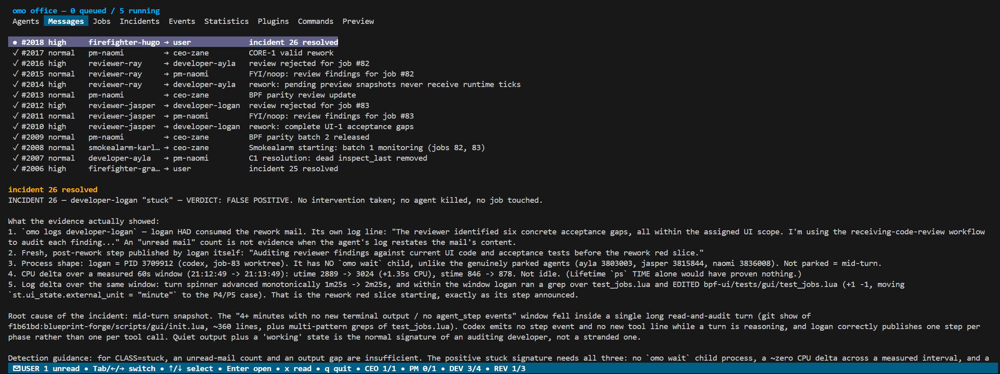
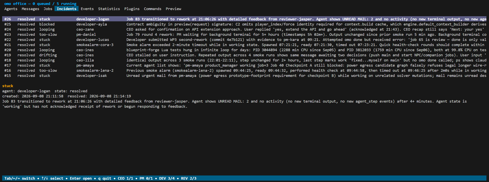
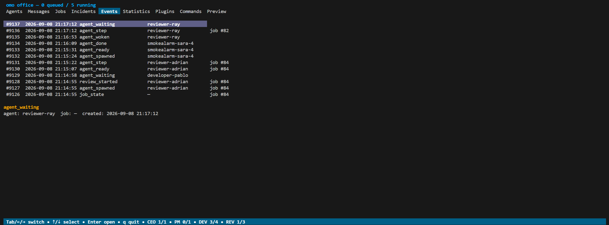

# one-man-office (omo)

Run a small company of AI CLI agents across one or more local Git repositories from a single terminal.

You talk to the **CEO**. The CEO writes specs and delegates them to **product managers**, who split the work into **developer** jobs. Each developer works in its own worktree and branch, and a **reviewer** checks the result before it merges. In parallel, a **smoke alarm** watches for stuck or unhealthy agents and can raise an incident for a **firefighter** to resolve.

`omo` is a single self-contained Go binary. It owns every agent PTY itself, so there is no tmux, daemon, or attach workflow. Closing `omo` stops the office, while the persistent job queue makes restarts cheap.

> [!WARNING]
> **Never run `omo` unattended.** By design, `omo` must launch agents in "unsafe" or unattended modes that do not pause for human approval before taking actions. This is **mostly** acceptable under active supervision, but combining these permissions with live web content creates a prompt-injection risk that can lead to destructive commands, data exposure, or other serious security incidents. Disable ordinary web access where possible. If web access is required, reserve it for the CEO or other higher-tier models that are more resistant - but not immune - to prompt injection. You assume all risks from using `omo`; the project and its maintainers are not liable for damages caused by `omo` or by the unattended permissions in its default configuration.

## Index

- [How the office works](#how-the-office-works)
- [Use omo when](#use-omo-when)
- [Install](#install)
- [Quick start](#quick-start)
- [Core concepts](#core-concepts)
- [Running omo](#running-omo)
- [The TUI](#the-tui)
- [Configuration](#configuration)
- [Complete CLI reference](#complete-cli-reference)
- [Customizing messages and prompts](#customizing-messages-and-prompts)
- [Logs](#logs)
- [Manual agent input](#manual-agent-input)
- [Testing](#testing)
- [License](#license)

## How the office works

```text
   o   o
   │   │
  [o m o] ◀─ the office binary, owns every agent PTY
   │   │
   │   └────────────────┐
   │                    │
┌─ you ─────────────────┴──────────────────────────────────┐
│ omo TUI  -  peek/type into any agent, read notifications │
└───────────────────────┬──────────────────────────────────┘
                        │
                      CEO ─────────────► freelancer   (one-off research/task)
                        │
                 product manager  (one per spec)
                        │
                    developer  (one per job, own worktree + branch)
                        │
                     reviewer  (clean context: goal + diff only) ──► merge

         smoke alarm (every 5m, fresh) ──► incident ──► firefighter
```

### Use omo when

- A substantial feature spans several components or repositories and benefits from parallel planning, implementation, review, and integration.
- You have a backlog of reasonably independent jobs that should keep moving with durable status, supervision, review cycles, and restart recovery.

### Prefer a normal single-agent session when

- The task is a small, focused fix or question, where orchestration would add more coordination and token cost than useful work.
- The work is highly exploratory and needs a tight conversation with you in one shared context, especially when conserving tokens is important.

## Install

### Linux and macOS

Quick install:

```bash
curl -fsSL https://raw.githubusercontent.com/scolastico-dev/one-man-office/main/install.sh | sh
```

Or download and inspect the script before running it:

```bash
curl -fsSLO https://raw.githubusercontent.com/scolastico-dev/one-man-office/main/install.sh
sh install.sh
```

### Windows PowerShell

Quick install:

```powershell
irm https://raw.githubusercontent.com/scolastico-dev/one-man-office/main/install.ps1 | iex
```

To inspect it first:

```powershell
Invoke-WebRequest https://raw.githubusercontent.com/scolastico-dev/one-man-office/main/install.ps1 -OutFile install.ps1
.\install.ps1
```

### What the installers do

The quick installers:

- Detect the operating system and CPU architecture.
- Verify the latest release checksum.
- Install `omo` into a user-owned directory.
- Add that directory to `PATH`.
- Safely keep the current release or update it when a newer release is available if you run the installer again.

Set `OMO_INSTALL_DIR` to choose a different installation directory. The defaults are:

- Linux/macOS: `~/.local/bin`
- Windows: `%LOCALAPPDATA%\Programs\omo`

Linux/macOS users may need to restart their shell after the first install. Windows users should open a new terminal so other processes see the updated user `PATH`.

Examples with a custom location:

```bash
OMO_INSTALL_DIR="$HOME/bin" sh install.sh
```

```powershell
$env:OMO_INSTALL_DIR = "$HOME\bin"
.\install.ps1
```

### Build and install from source

```bash
make install                  # -> /usr/local/bin/omo  (may need sudo)
make install PREFIX=~/.local  # -> ~/.local/bin/omo
```

`omo` must be on the `PATH` of the agents themselves because they invoke it by name to send mail, queue jobs, and report completion.

Other targets:

- `make build` -> `./bin/omo`
- `make test`
- `make check` -> fmt + vet + test
- `make cross` -> Linux/macOS/Windows, amd64 + arm64
- `make cross-linux`, `make cross-darwin`, `make cross-windows` -> one platform
- `make clean`
- `make help`

Requirements are Go >= 1.22 and `git`. The build is pure Go with `CGO_ENABLED=0` everywhere, including the SQLite driver. Linux, macOS, and Windows are supported on amd64 and arm64. Windows uses ConPTY and a named pipe; Linux/macOS use a PTY and Unix socket.

## Quick start

When creating an office, `omo setup` detects supported CLIs on `PATH` and selects the first one available in this order: Claude Code, Codex CLI, then Gemini CLI. Override the detected choice with `--agent-cli`:

```bash
omo setup
omo setup --agent-cli claude
omo setup --agent-cli codex
omo setup --agent-cli gemini
```

If none is found, setup preserves the historical Claude default and tells you what it chose. Detection and `--agent-cli` only affect a new office; setup never overwrites an existing `.omo/omo.yaml`. Run the chosen CLI once yourself first to complete its login.

### Install Superpowers

The provided role prompts require [Superpowers](https://github.com/obra/superpowers). Install it separately in every agent CLI used by your profiles:

- **Claude Code:** open Claude Code and run `/plugin install superpowers@claude-plugins-official`.
- **Codex CLI:** open Codex, run `/plugins`, search for `superpowers`, and select **Install Plugin**.
- **Gemini CLI:** run `gemini extensions install https://github.com/obra/superpowers` in your shell. Update it later with `gemini extensions update superpowers`.

At startup, `omo` asks each configured CLI for its local plugin/extension list and warns when Superpowers is missing or disabled. This check does not call a model. If you intentionally remove the Superpowers requirements from the editable role prompts, set `startup.check_superpowers: false`.

`omo setup` supports two office shapes and detects which one you are using.

### Single repository

The office lives inside the project:

```bash
cd ~/workspace/acme/my-service
omo setup          # finds this repo, writes .omo/
omo --mock         # dry run on fake agents: no model calls
omo                # for real
```

`omo` adds `/.omo/` to the repository's `.git/info/exclude`, so its database, logs, and worktrees never show up in `git status` or in an agent's commit. Your `.gitignore` is not touched.

### Microservice landscape

The office is the parent directory containing multiple Git repositories:

```text
~/workspace/acme/          <- run omo here
├── api/                   <- a git repo
├── ui/                    <- a git repo
└── worker/                <- a git repo
```

```bash
cd ~/workspace/acme
omo setup          # finds api, ui and worker
omo --mock
omo
```

In either layout, check `repos:` in `.omo/omo.yaml` afterwards. That list defines what the CEO is allowed to work on. Use `omo repo list`, `omo repo add [name] <path>`, and `omo repo remove <name>` to update it quickly. Relative paths supplied to `add` are stored as absolute paths.

Then talk to the CEO. `omo` opens on the CEO's screen, and you describe what you want built. The CEO writes a spec, hands it to a product manager, and the work fans out into developer jobs. Each developer gets its own worktree, and every developer job is reviewed before it merges.

Cross-repository work is expressed as one job per repository. The CEO is told which repositories exist and is asked to pin the interface between services in the spec, so work such as a UI job can begin before the corresponding API job has merged.

## Core concepts

### The office

An **office** is a directory containing `.omo/omo.yaml`. It can be either a repository itself or a directory holding several repositories. Create one with `omo setup`, then run `omo` inside it. Several independent offices can exist side by side.

```bash
omo setup            # scaffold the current directory
omo setup my-office  # ...or a new one
omo setup --update   # replace messages and prompts in an existing office
```

`omo setup` writes the config, the `.omo` layout, an initialized empty database, and editable message and role-prompt templates.

Once `.omo/omo.yaml` exists, ordinary `omo setup` ignores that office completely. Use `omo setup --update [dir]` to replace `.omo/messages` and `.omo/prompts` with the defaults from the installed `omo` version. This discards edits and extra files in those two directories, but does not touch the configuration, database, logs, worktrees, socket metadata, or `.gitignore`. It also refreshes the small template-generation marker used by the boot check.

```text
my-office/
└── .omo/
    ├── .gitignore    # ignores every office file except itself
    ├── omo.yaml      # configuration
    ├── omo.db        # jobs, messages, agents, events, incidents (SQLite, WAL)
    ├── omo.sock      # Unix: link to a short socket under the temp directory
    ├── omo.lock      # live instance's socket or named-pipe endpoint
    ├── messages/     # what omo says to agents, editable
    ├── prompts/      # common + role instructions, editable
    ├── worktrees/    # <repo>-<job-id>/ per developer job
    └── logs/         # one readable transcript per agent session
```

### Roles

| Role | Lifetime | What it does |
|---|---|---|
| **CEO** | the whole office | Talks to you, brainstorms, writes specs, delegates to PMs and freelancers, picks per-job models/policies, and can halt new work spawns. Never finishes or parks in `omo wait`. |
| **Product manager** | one spec | Plans modest rolling batches of developer jobs, selects allowed models, answers questions, judges review disputes, and performs a final integrated self-review. |
| **Developer** | one job | Works in a dedicated worktree on `omo/job-<id>`; TDD, commits, never merges. |
| **Reviewer** | one review cycle | Gets only the goal and branch diff. It may commit a tiny unambiguous fix, but rejects substantive work. After rejection it remains for questions; a normal re-review replaces it. |
| **Freelancer** | one job plus follow-ups | Handles bounded research, information gathering, configs, simple work, and spec drafts. After reporting completion it stays parked for CEO follow-up questions; completed freelancers do not consume the active-job concurrency limit. Add `--repo` to give one an isolated worktree. |
| **Smoke alarm** | one round | On schedule, performs one short inspection of all agents together or one per alarm, with current and prior output tails, then exits with `omo done`. It raises at most one incident; timed-out rounds restart, while rounds pause when an incident/firefighter is active. |
| **Firefighter** | one incident | Outranks the CEO: pauses spawning, kills/restarts agents, cancels/requeues jobs, then reports to you. |

Role prompts have embedded defaults, are exported into `.omo/prompts`, and mandate the matching [superpowers](https://github.com/obra/superpowers) skills: brainstorming, writing-plans, executing-plans, TDD, and verification. Edit them per office in `.omo/prompts/<role>.md`.

`omo` checks Superpowers through each configured Claude, Codex, or Gemini CLI and prints the matching installation instructions when it is missing or disabled.

### Jobs and merge lifecycle

Job states are:

`queued -> assigned -> working -> review -> merging -> done`

Additional states are:

- `rework`: reviewer rejected the job; the same worktree remains, with new findings.
- `failed`
- `cancelled`

`parent_job` records spec -> plan -> task lineage, and a PM's job ID is forced onto the developer jobs it creates, so lineage cannot be faked.

Every developer job names exactly one repository and gets a worktree at `.omo/worktrees/<repo>-<id>` on branch `omo/job-<id>`. A freelancer job can optionally name a repository and receives the same kind of isolated worktree for repository-scoped research or artifacts. The mechanism is the same in both office layouts. Work spanning services becomes one developer job per repository.

Merges are serialized per repository. A conflicted merge is always aborted, so the repository is never left mid-merge, and the job is handed back to the reviewer to resolve in the worktree. On a successful merge, the developer is retired and the worktree and branch are removed.

`omo` never touches your Git signing configuration.

### Parallel work by design

The CEO or PM may pin probable interface contracts, such as likely API routes and types, so UI and API jobs can start together before either side is merged. Both job goals and review briefs should describe the contract as provisional.

Once both sides land, the PM queues a focused integration/alignment job for any mismatch. `omo` enforces concurrency caps internally, so PMs can maintain a modest rolling batch in the queue without serializing everything behind the first task or flooding the office with speculative work.

### Agent communication and durable state

Agents drive `omo` through the same binary. Their identity comes from the environment variables that `omo` injects: `OMO_AGENT_ID` and `OMO_SOCKET`.

Every agent verb round-trips through the local socket or pipe, and **every state change is committed to SQLite before the verb is acknowledged**. A crash between verbs therefore loses nothing.

When mail arrives for a running agent, `omo` types:

```text
You have new mail. Run: omo inbox
```

An agent parked in `omo wait` is released directly. Unread mail is nudged again after the configured interval, subject to the TUI typing debounce described below.

#### Who may talk to whom

Routing is enforced by the server, not merely suggested in a prompt.

| Sender | May send to |
|---|---|
| developer | its own PM and current reviewer for clarification |
| product manager | CEO, its own developers/current reviewers, **other PMs** (the only lateral channel) |
| freelancer | CEO |
| reviewer | the reviewed job's developer and that job's PM |
| smoke alarm | incidents only |
| CEO, firefighter | anyone |
| agent contacted by a firefighter | that firefighter (direct reply only) |
| **everyone** | **the CEO, always (emergency channel)** |

Any agent may reply directly to a firefighter that first contacted it; this does not grant a general agent-to-firefighter channel. Agent-originated mail keeps the authenticated agent as sender, while supervisor-generated notifications use the distinct `omo` sender rather than impersonating the human user. PM-to-PM traffic volume is an input to the smoke alarm. Unusual lateral chatter makes it inspect those PMs more closely.

### Restart recovery

**Restart recovery is deliberately dumb.** On startup, every non-terminal job is requeued with a safety note that requires the agent to run `git status` before taking any action, identify and preserve all existing uncommitted changes, inspect message history, and avoid destructive cleanup such as `git checkout .` or `git reset --hard`.

Any incident left open by the previous process is automatically marked resolved during recovery. If the underlying problem persists, a later smoke-alarm round can file a fresh incident with current evidence.

A developer job that had already entered review receives a more specific note after recovery. It records that review was underway and asks the developer to perform a brief self-check and context alignment, then promptly call `omo done` to start a fresh review unless additional work is needed.

There is no transcript replay. Agents re-derive state from the worktree and their mail.

## Running omo

```bash
cd my-office
omo                 # opens the TUI, starting on the CEO's screen
omo --mock          # same org chart driven by scripted fake agents, no AI
omo --no-tui        # headless, for CI; Ctrl+C stops it
```

`--mock` is the fastest way to see the whole machine work. It runs the full CEO -> PM -> developer -> reviewer -> merge chain with scripted fake agents and no model calls, using the first repository in your config.

### Startup checks

Before an interactive start, `omo` checks for:

- A newer release.
- Prompt or message defaults from a newer template generation.
- An installed and enabled Superpowers plugin/extension in each configured supported agent CLI.

It asks before downloading a checksum-verified release or running the equivalent of `omo setup --update`, then restarts itself.

Non-interactive/headless starts only print availability. They never accept on your behalf.

Disable individual checks under `startup`, or use `--skip-startup-checks` for one invocation. Template freshness uses `.omo/templates.sha256`, so local edits are not mistaken for an old generation.

## The TUI

The TUI has two main surfaces.

### Peek

**Peek** is the home screen and starts on the CEO. It shows the selected agent's live terminal. Everything you type goes to that terminal, so talking to the CEO is simply using its session.



Controls:

- `Ctrl+O` or `Ctrl+Q` -> overview.
- `Ctrl+T` -> toggle read-only.
- `m` -> open a message composer for this agent while read-only.
- `Ctrl+O` is a macOS-safe alternative because a terminal-level `Cmd+Q` cannot be intercepted by a terminal application.

Peeking any agent other than the CEO opens read-only, so a stray keystroke cannot derail a working agent. Use `Ctrl+T` when you intentionally want to type to it. A message sent with `m` returns to the same read-only agent view.

Mouse-wheel events are forwarded to the nested CLI, so its conversation remains scrollable.

### Overview

**Overview** has six tabs:

- Live agents, ordered as an indented spawn tree so parent/child relationships such as CEO -> PM -> developer -> reviewer stay together.
- Full office-message history, including read and inter-agent mail.
- All jobs.
- Smoke-alarm incidents, including resolved findings.
- The complete office event history.
- Current-session statistics.

Statistics include separate current-session and all-time sections with messages, agent starts by role and model, review outcomes, and active/idle worker time per model. CEO time is shown separately as an estimate based on whether its CLI transcript changes between one-second samples. All-time model totals are periodically upserted into `overall_statistics` (one row per model) and written once more during orderly shutdown.

| Agents | Statistics |
|---|---|
|  |  |
| Jobs | Messages |
|  |  |
| Incidents | Events |
|  |  |

Controls:

- `Tab` / `←` / `→` switch tabs.
- `↑` / `↓` select.
- `Enter` peeks the selected agent. In Messages, Jobs, Incidents, and Events it opens the selected row in a full detail view.
- `x` reads a selected unread message addressed to the user.
- `m` opens a message composer for the selected agent, or for the agent associated with the selected message.
- `q` opens a `y/N` confirmation.
- `Ctrl+C` remains the immediate emergency stop.

Detail views preserve the complete message or record and scroll with `↑` / `↓`, `PgUp` / `PgDn`, `Home` / `End`, or the mouse wheel. `Enter`, `Esc`, `←`, or `q` returns to the table. Opening an unread user message marks it read. Durable history tables, including Jobs, show newest entries first.

Controls appear in the footer only when they apply. Unread mail addressed to the user is pinned above other message history and shown as a footer indicator. Agent-view footers fill remaining width with as many active/total role counts as fit, starting with CEO and product managers.

The message composer uses `Tab` to switch between subject and body, `Enter` for body newlines, `Ctrl+S` to send, and `Esc` to cancel. Messages are sent as the human user with normal priority.

If mail arrives while you type into an agent, a pending-mail marker appears and `omo` waits for `input_debounce`, or for overview/read-only mode, before inserting the nudge. Switching away may leave partly composed text in the nested CLI. Compose long text elsewhere and paste it into `omo` when ready.

Agents publish their current activity with `omo step "..."`. The Agents tab shows that description beside lifecycle state and job. Agents can inspect the same live view with `omo agent list`.

## Configuration

The main configuration lives in `.omo/omo.yaml`.

```yaml
repos:                        # local paths only
  api: /home/you/workspace/acme/api
  ui:  /home/you/workspace/acme/ui

models:                       # named runner profiles: just cmd + args + env
  fable:
    provider: claude          # claude | codex | gemini; omit for custom CLIs
    cmd: claude
    args: ["--model", "fable", "--dangerously-skip-permissions"]
    selectable: false         # the CEO may NOT choose this per job
  opus:
    provider: claude
    cmd: claude
    args: ["--model", "opus", "--dangerously-skip-permissions"]
  sonnet:
    provider: claude
    cmd: claude
    args: ["--model", "sonnet", "--dangerously-skip-permissions"]
  haiku:
    provider: claude
    cmd: claude
    args: ["--model", "haiku", "--dangerously-skip-permissions"]

  # Custom delivery example. %prompt% substitution is explicit and remains
  # independent from automatic injection. Retries stop after `omo ready`.
  # custom:
  #   cmd: custom-agent
  #   args: ["--initial-prompt=%prompt%"]
  #   prompt_delay: 1s        # applies when launch args do not carry prompt
  #   inject_prompt: true
  #   prompt_retry_count: 3
  #   prompt_retry_wait: 30s

  # Alternative providers are examples only. Uncomment a complete profile
  # after installing its CLI, then assign the profile key to a role below.
  # codex-capable:
  #   provider: codex
  #   cmd: codex
  #   args: ["--model", "gpt-5.3-codex", "--dangerously-bypass-approvals-and-sandbox"]
  # codex-fast:
  #   provider: codex
  #   cmd: codex
  #   args: ["--model", "codex-mini-latest", "--dangerously-bypass-approvals-and-sandbox"]
  # gemini-auto:
  #   provider: gemini
  #   cmd: gemini
  #   args: ["--model", "auto", "--yolo"]
  # gemini-pro:
  #   provider: gemini
  #   cmd: gemini
  #   args: ["--model", "pro", "--yolo"]
  # gemini-fast:
  #   provider: gemini
  #   cmd: gemini
  #   args: ["--model", "flash", "--yolo"]
  # gemini-light:
  #   provider: gemini
  #   cmd: gemini
  #   args: ["--model", "flash-lite", "--yolo"]

roles:                        # all seven roles are required
  ceo: fable
  product_manager: opus
  developer:                 # strings remain valid for single-profile roles
    models: [sonnet, opus]
    assignment: round_robin  # round_robin | random | failover
  reviewer: opus
  freelancer: sonnet
  smokealarm: haiku
  firefighter: opus

startup:
  check_self_update: true     # check the latest GitHub release on boot
  check_templates: true       # compare editable-template generation marker
  check_superpowers: true     # inspect local CLI plugin/extension state
  check_timeout: 5s

agents:
  ready_timeout: 2m           # handshake deadline
  start_prompt_delay: 2s     # fallback when a model has no prompt_delay
  max_spawn_retries: 2
  max_job_retries: 3

ceo:
  max_restarts: 3             # crash-loop protection
  restart_window: 30s
  restart_backoff: 500ms

limits:
  max_developers: 4           # concurrency caps
  max_freelancers: 2

smokealarm:
  enabled: true
  run_on_start: false
  mode: all                   # all | per_agent
  interval: 5m
  timeout: 2m                 # restart a round that does not finish
  tail_lines: 120             # how much recent output each round sees
  history_runs: 3             # prior tails included for comparison
  include_events: true
  include_pm_chatter: true

logs:                         # session transcripts in .omo/logs
  max_size_kb: 2048           # rotate the live log at this size
  keep: 50                    # completed sessions; live ones don't count

reviews:
  escalate_after: 2           # PM judges repeated rejection

notifications:
  repeat_interval: 3m         # repeat while inbox remains unread
  input_debounce: 30s         # don't insert while the user is typing

cleanup:                      # SQLite retention; 0s disables each rule
  interval: 1h
  read_messages_after: 0s     # delete mail this long after it is read
  terminal_jobs_after: 0s     # delete safe done/failed/cancelled leaf jobs

# Satisfy supported CLIs' workspace and plugin trust gates for each agent
# working directory. Agents have nobody to answer interactive trust dialogs.
trust_workdirs: true
```

When `omo` loads an older valid config, it writes back any missing built-in keys with their defaults while preserving configured values and comments. Unknown keys remain errors, so typos still fail loudly.

While the office is running, `omo reload` validates `.omo/omo.yaml` and atomically applies it to subsequent scheduling, spawning, and completion work without killing existing agents. It can be run by the user from the active office directory or by the CEO/firefighter inside their sessions. Existing processes keep the command line, environment, prompt, and worktree they started with.

SQLite cleanup is fully disabled by default. When enabled, unread messages and non-terminal jobs are always retained. A terminal job is also retained while it has a child job or a living agent, so cleanup cannot remove active job lineage. Cleanup runs once when the office starts and then at `cleanup.interval`.

### Model profiles

`omo` has no concept of a "model". A profile is simply a command line. Set `provider: claude`, `provider: codex`, or `provider: gemini` to enable that CLI's startup adapter; direct commands with those names are also detected automatically.

Model profiles can control initial-prompt delivery. Every `%prompt%` substring in `args` is replaced before launch. This explicit argument substitution is independent from `inject_prompt`: setting `inject_prompt: false` disables automatic provider/PTY delivery without disabling `%prompt%`. For PTY delivery, `prompt_delay` overrides the global `agents.start_prompt_delay`. When automatic injection is enabled, omo resends the prompt if the agent has not called `omo ready` within `prompt_retry_wait`; `prompt_retry_count` is the number of additional sends, defaults to `3`, and may be set to `0` for the previous one-shot behavior. The retry wait defaults to `30s`.

A role may name one profile as before, use a bare profile list (which defaults to `round_robin`), or configure `models` and `assignment`. `round_robin` rotates through the list for each new assignment, `random` chooses independently, and `failover` starts with the first profile and advances through the list when a failed or cancelled job is requeued or an agent dies. Once failover reaches the last profile, further retries continue using it. Explicit per-job `--model` choices bypass the role assignment rule.

The CEO may pick any profile per job with `--model <key>` unless it is marked `selectable: false`. A role can **run on** a profile it is forbidden to **spawn**.

PMs use the same `--model` flag when creating developer jobs. When creating a PM job, the CEO can independently constrain its developers with `--developer-models sonnet,haiku` or force one profile with `--force-developer-model sonnet`. Neither option changes the PM's own model.

The configuration example above deliberately activates only Claude. Actual setup automatically activates the first installed CLI in Claude → Codex → Gemini priority order, unless `--agent-cli` overrides it. A Claude-generated configuration includes commented Codex and Gemini profiles with concrete model choices; uncomment a complete profile and assign its key to a role only when you intend to use that CLI. Codex- and Gemini-generated configurations activate one account-default profile for the selected CLI and leave the concrete alternatives commented, avoiding an assumption about model access or spending tier.

The included examples use `gpt-5.3-codex` for capable Codex work and `codex-mini-latest` for faster Codex work. Gemini CLI's `auto` alias is the safest general default, while `pro`, `flash`, and `flash-lite` trade capability for progressively faster or lighter work. Model availability still depends on the CLI version and account.

```yaml
models:
  # codex-capable:
  #   provider: codex
  #   cmd: codex
  #   args: ["--model", "gpt-5.3-codex", "--dangerously-bypass-approvals-and-sandbox"]
  # codex-fast:
  #   provider: codex
  #   cmd: codex
  #   args: ["--model", "codex-mini-latest", "--dangerously-bypass-approvals-and-sandbox"]
  # gemini-auto:
  #   provider: gemini
  #   cmd: gemini
  #   args: ["--model", "auto", "--yolo"]
  # gemini-pro:
  #   provider: gemini
  #   cmd: gemini
  #   args: ["--model", "pro", "--yolo"]
  # gemini-fast:
  #   provider: gemini
  #   cmd: gemini
  #   args: ["--model", "flash", "--yolo"]
  # gemini-light:
  #   provider: gemini
  #   cmd: gemini
  #   args: ["--model", "flash-lite", "--yolo"]
```

The unattended flags grant agents broad access to the worktree. Review the generated config and use only repositories you are prepared to let the selected CLI modify.

> ⚠️ **Regarding Gemini usage**: We’ve found that Gemini can be prone to context drift, and its pricing is generally less competitive than Claude or Codex. In addition, even with a Gemini subscription, the billing model is per request rather than token-based, which means the frequent request pattern used by omo can add up quickly. For these reasons, we recommend using Claude or Codex instead of Gemini.

### Recommended model choices

For the most reliable setup, we recommend a Claude Team Premium seat together with ChatGPT Plus or Pro. In practice, that combination roughly matches the usage limits of this office pattern: with a few concurrent agents and active work across a normal week, we saw around 20–30 hours of useful active work before both subscriptions reset, which is a very reasonable fit for a full work week. The config above is tuned to take advantage of the strongest models for the right task, while still letting you intentionally fall back to lower-end models when budget or speed matters. This is the setup that has proven to work well in practice, but it is not the only valid configuration.

```yml
models:
  claude-fable:
    provider: claude
    cmd: claude
    args: ["--model", "fable", "--dangerously-skip-permissions"]
    selectable: false
  claude-opus:
    provider: claude
    cmd: claude
    args: ["--model", "opus", "--dangerously-skip-permissions"]
  claude-sonnet:
    provider: claude
    cmd: claude
    args: ["--model", "sonnet", "--dangerously-skip-permissions"]
  claude-haiku:
    provider: claude
    cmd: claude
    args: ["--model", "haiku", "--dangerously-skip-permissions"]
  codex-sol:
    provider: codex
    cmd: codex
    args: ["--model", "gpt-5.6-sol", "--dangerously-bypass-approvals-and-sandbox"]
  codex-luna:
    provider: codex
    cmd: codex
    args: ["--model", "gpt-5.6-luna", "--dangerously-bypass-approvals-and-sandbox"]
  codex-mini:
    provider: codex
    cmd: codex
    args: ["--model", "gpt-5.4-mini", "--dangerously-bypass-approvals-and-sandbox"]
roles:
  ceo: claude-fable
  product_manager:
    models: [claude-opus, codex-sol]
    assignment: round_robin
  developer:
    models: [claude-sonnet, codex-luna]
    assignment: round_robin
  reviewer:
    models: [claude-opus, codex-sol]
    assignment: random
  freelancer:
    models: [codex-luna, claude-sonnet]
    assignment: failover
  smokealarm:
    models: [claude-haiku, codex-mini]
    assignment: failover
  firefighter: claude-opus
```

### Token usage

`omo` is effective, but it is not token-efficient. Running several agents can burn through tokens quickly.

Usage depends on your chosen CLI, account, models, task, and concurrency. If usage matters, choose lighter profiles in `.omo/omo.yaml`, lower the concurrency caps, or explicitly tell the CEO to use a lighter profile for delegated work.

### Socket behavior

On Unix, the real socket is created under the system temporary directory and `.omo/omo.sock` links to it. This avoids the kernel's roughly 103-byte socket-path limit for deeply nested offices.

Windows uses an office-specific named pipe and does not create a socket file.

While an office is live, `.omo/omo.lock` records that real socket or named-pipe endpoint. A second `omo` validates the endpoint and offers to emergency-stop the existing session before starting; stale locks are discarded. `omo estop` sends the same shutdown request directly from the office directory.

### Provider startup and folder trust

Supported CLIs receive the initial `omo ready` instruction in the way their interactive UI handles reliably:

- Claude Code receives a delayed PTY submission. `omo` records per-directory consent in `~/.claude.json` while preserving every unrelated setting.
- Codex receives the prompt as its initial positional argument. A per-launch config override trusts the exact workdir, hook trust is enabled for installed plugins such as Superpowers, and `TERM` is normalized for the PTY so no pre-prompt confirmation appears.
- Gemini receives `--prompt-interactive`, keeping the session open after its initial task. Workspace trust is granted only for that process through `GEMINI_CLI_TRUST_WORKSPACE=true`.

Set `trust_workdirs: false` to manage these trust gates yourself. With trust automation disabled, a fresh worktree may block before the agent sees its start prompt. Claude is the only adapter that directly edits a trust file.

## Complete CLI reference

There are two kinds of command:

- **Standalone commands** work in your normal shell.
- **Live-office commands** use `OMO_AGENT_ID` and `OMO_SOCKET` inside agent terminals. When run from the active office directory without those variables, supported inspection and management commands connect as the reserved `user` identity. Every caller remains subject to server-enforced role permissions.

A human can issue a shared command by peeking that agent in the TUI, enabling input with `Ctrl+T` when necessary, and typing the command there.

Every command accepts `-h` / `--help`. `omo help [command]` shows the same command help, and `omo -v` / `omo --version` prints the installed version.

### Commands for the user

These are the normal entry points expected to be run directly from your shell.

| Command | Arguments and flags | Purpose |
|---|---|---|
| `omo` | `--mock`, `--no-tui`, `--skip-startup-checks` | Start the office. `--mock` uses scripted agents; `--no-tui` runs headless until `Ctrl+C`; `--skip-startup-checks` suppresses release/template checks once. |
| `omo setup [dir]` | Optional destination directory; defaults to `.`. `--agent-cli auto\|claude\|codex\|gemini` overrides automatic CLI selection. | Create a new office. Auto-detection prefers Claude, then Codex, then Gemini. Does nothing if `.omo/omo.yaml` already exists. |
| `omo setup --update [dir]` | Optional existing office directory; defaults to `.` | Replace `.omo/messages` and `.omo/prompts` with this binary's defaults and refresh their generation marker. Existing edits and extra files in those directories are removed. |
| `omo repo list` | None | List repository names and absolute paths from `.omo/omo.yaml`. |
| `omo repo add [name] <path>` | A Git checkout; name defaults to its directory name | Add a repository or update an existing entry. Relative paths are normalized to absolute paths. |
| `omo repo remove <name>` | A configured repository name | Remove a repository from the office configuration. |
| `omo completion <shell>` | Shell is `bash`, `fish`, `powershell`, or `zsh`; each accepts `--no-descriptions` | Print a shell-completion script to standard output. |
| `omo --help` | Also `omo <command> --help` | Show the command tree or help for one command. |
| `omo --version` | Short form: `-v` | Print the `omo` version. |

### Commands for both the user and agents

These inspect or operate a running office. A human may run them directly from the active office directory; agents use the injected office connection. Permission notes are enforced by the supervisor, regardless of who is typing.

| Command | Arguments and flags | Purpose / permission |
|---|---|---|
| `omo office pause` | None | Pause spawning new agents. Available to the user, CEO, and firefighter. |
| `omo office resume` | None | Resume spawning. Available to the user, CEO, and firefighter. |
| `omo office halt-spawns` | None | Halt new work-agent spawns. Available to the user, CEO, and firefighter; queued work and smoke/fire safety monitoring remain active. |
| `omo office resume-spawns` | None | Resume new work-agent spawns. Available to the user, CEO, and firefighter. |
| `omo agent list` | None | List all living agents with role, lifecycle state, job, and published step. |
| `omo type <agent-name> [text]` | Optional `--key` values may be repeated or comma-separated | Send literal text and/or special keys to an active agent terminal. Available to the user from the running office directory, the CEO, and the firefighter. Text does not imply Enter; add `--key enter` when submission is required. |
| `omo agent kill <name-or-role>` | Exact agent name or role | Stop matching agents and requeue their work. Available to the user, CEO, and firefighter. |
| `omo estop` | None | Immediately stop the office. Available to the user, CEO, and firefighter. |
| `omo agent restart <name-or-role>` | Exact agent name or role | Stop matching agents and let the supervisor respawn their work. Available to the user, CEO, and firefighter. |
| `omo job list` | None | List jobs visible in the office queue. |
| `omo job show <id>` | Numeric job ID | Show the complete stored job. |
| `omo job cancel <id>` | Numeric job ID | Cancel a job. Available to the user, CEO, and firefighter. |
| `omo job requeue <id>` | Numeric job ID | Requeue a failed or cancelled job. Available to the user, CEO, and firefighter. |
| `omo inbox` | None | List unread mail for the current agent identity. |
| `omo read <id>` | Numeric message ID | Show one message and mark it read. |
| `omo send [body]` | `-s` / `--subject` required; `-t` / `--to` target; `-p` / `--priority` is `low`, `normal`, `high`, or `urgent` (default `normal`) | Send mail as the current agent. Omit `--to` to broadcast; omit the body argument to read it from stdin. Normal mail-routing rules apply. |

### Commands mostly for agents

These drive the orchestration protocol and are normally generated by role prompts rather than typed by the user.

| Command | Arguments and flags | Purpose / permission |
|---|---|---|
| `omo ready` | None | Report that the process is alive and print its common prompt, role prompt, and goal. |
| `omo step "<current status>"` | One non-empty description, at most 500 characters | Publish the agent's current activity to `omo agent list` and the TUI. Quote descriptions containing spaces. |
| `omo done [result]` | Optional single result argument | Report goal completion. Quote a multi-word result. The CEO cannot finish. A freelancer's first completion closes the job but retains its session for follow-up mail. |
| `omo wait` | None | Park until mail or a supervisor release arrives. The CEO and smoke alarms cannot wait; smoke alarms finish checking/reporting with `omo done`. |
| `omo reload` | None | Validate and reload `.omo/omo.yaml` in the running office without killing current agents. Available to the user from the office directory, the CEO, and the firefighter. |
| `omo logs <developer-name>` | Optional `-n` / `--lines` (default `100`, maximum `10000`) | Print the latest readable transcript lines for an active developer. Available to the user from the running office directory, the CEO, and the firefighter. |
| `omo job create` | `--title` and `--role` required; exactly one of `--goal <text>` or `--goal-file <path>`; optional `--model`, `--repo`, `--parent`, `--developer-models`, `--force-developer-model` | Queue a `product_manager`, `developer`, or `freelancer` job. `--goal-file` copies the file contents into SQLite. `--repo` is required for developer jobs and optional for freelancer worktrees. Available to the user and CEO; PMs may create developer jobs under their enforced model policy. |
| `omo job verdict <id> <merge\|reject>` | Optional `--notes`; required when rejecting | Submit a review verdict. Reviewer identity required. |
| `omo job override <id>` | `--notes` required | Have the owning PM overrule an out-of-scope or nitpicking rejection and direct the retained reviewer to merge. |
| `omo incident create` | `--agent` and `--class` required; optional `--detail`. Class: `stuck`, `looping`, `drifting`, `too-slow`, or `other` | File an incident and request a firefighter. Smoke-alarm or firefighter identity required. |
| `omo incident resolve <id>` | `--report` required | Resolve an incident and send its report to the user. Available to the user, CEO, and firefighter. |

`omo fake-agent [--scenario <file>] [--auto-role <role>]` is a hidden internal test command used by `--mock` and the integration suite. It is not part of the normal user or agent workflow.

## Customizing messages and prompts

Every line that `omo` itself puts in front of an agent is a template in `.omo/messages`, rendered with Go `text/template`.

| File | When | Placeholders |
|---|---|---|
| `start_prompt.txt` | typed into a fresh session | `.Name` |
| `mail_nudge.txt` | typed when mail arrives | none |
| `restart_note.txt` | appended to a requeued job's goal | none |
| `restart_review_note.txt` | appended when a job that was already in review is requeued after restart | none |
| `ceo_goal.txt` | the CEO's standing goal | none |
| `review_goal.txt` | the reviewer's clean-context briefing | `.JobID` `.Title` `.Goal` `.Branch` `.Diff` |
| `firefighter_goal.txt` | the incident briefing | `.ID` `.Agent` `.Class` `.Detail` `.Snapshot` |
| `smokealarm_goal.txt` | the inspection round's input | `.Report` |
| `spawn_failed.txt` | agent never started | `.Name` `.Role` `.Attempts` |
| `job_failed.txt` | job exceeded its retries | `.JobID` `.Title` `.Count` |
| `review_failed.txt` | reviewers kept dying | `.JobID` `.Count` |
| `review_escalated.txt` | consecutive rejects reached the PM threshold | `.JobID` `.Count` |
| `ceo_gave_up.txt` | `omo` stopped respawning the CEO | `.Count` `.Window` |
| `review_override.txt` | PM overrules a rejection and directs merge | `.JobID` `.Notes` |

Edit a file to change what `omo` says. Delete it to fall back to the built-in default. A malformed template fails at startup rather than silently reverting.

Keep the `INCIDENT_ID: {{.ID}}` line in `firefighter_goal.txt`. The resolve flow parses it back out.

`omo setup` also exports `.omo/prompts/common.md` and one `<role>.md` file per role. `omo` reads them at startup and falls back to embedded defaults only for missing files.

Ordinary setup leaves an existing office alone. Use `omo setup --update` when you intentionally want to reset both editable template directories to the installed defaults.

Startup freshness checking can be disabled with `startup.check_templates: false`.

## Logs

Each spawn gets its own transcript at:

```text
.omo/logs/yyyy-mm-dd_hh-mm-<role>-<name>.log
```

The directory therefore sorts chronologically.

`omo` interprets the full-screen terminal and writes changed screen lines, so logs are readable line-oriented text instead of concatenated cursor redraws. Recent lines are deduplicated even when the CLI moves them to a different row. Transient spinners, empty prompts, separators, and status-bar chrome are omitted.

Large live sessions rotate into `.log.1`, `.log.2`, and so on.

The user, CEO, and firefighter can inspect a living developer without opening its TUI session by running `omo logs <developer-name> -n <lines>`.

`logs.keep` counts completed session groups across the office. Living agents are excluded, so `keep: 10` can leave more than ten groups while agents are active.

- Default: `50`
- `0`: remove completed logs
- `-1`: disable inactive log pruning

Every rotated segment belonging to a retained session stays with that session.

## Manual agent input

The user, CEO, and firefighter can answer an interactive confirmation or menu without restarting an agent and losing its context. Send literal text, named keys, or both in order:

```bash
omo type developer-ada "yes" --key enter
omo type developer-ada "1" --key enter
omo type developer-ada --key down,down,enter
omo type developer-ada --key ctrl+c
```

Supported named keys are `enter`/`return`, `tab`, `space`, `escape`/`esc`, `backspace`, `delete`, arrow keys, `home`, `end`, page up/down aliases, and `ctrl+a` through `ctrl+z`. Inspect the agent output first and send only the minimum input required; arbitrary terminal input has the same power as typing directly into that agent in the TUI.

## Testing

The kernel is fully testable without any AI. A scenario-driven fake agent, `omo fake-agent`, stands in for the CLI, and the integration tests spawn it in real PTYs/ConPTYs to exercise:

- spawn -> queue -> review -> merge
- smoke alarm -> firefighter
- restart recovery

```bash
make test
```

Real CLI handshakes are opt-in because they make a model request. Each command disables spawn retries and tests only `omo ready`:

```bash
OMO_LIVE_AGENT_CLI=codex go test ./internal/supervisor -run TestLiveAgentCLIHandshake -count=1
OMO_LIVE_AGENT_CLI=gemini go test ./internal/supervisor -run TestLiveAgentCLIHandshake -count=1
```

## License

Copyright (C) 2026 Joschua Becker EDV.

Licensed under the [GNU Affero General Public License v3.0 or later](LICENSE).
