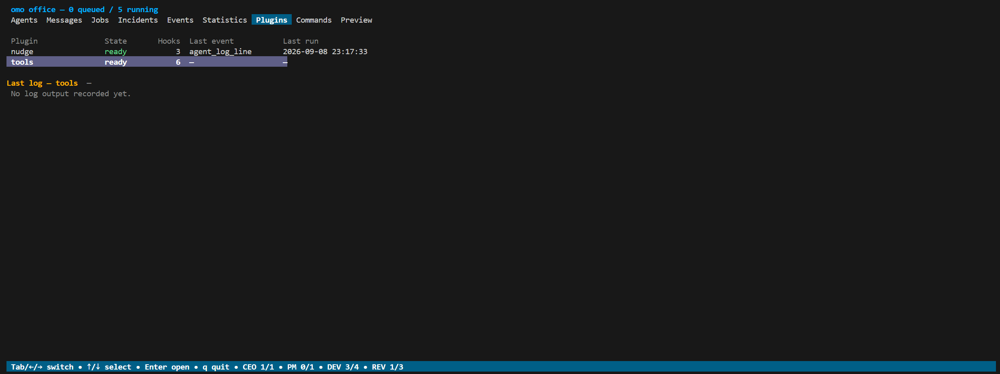
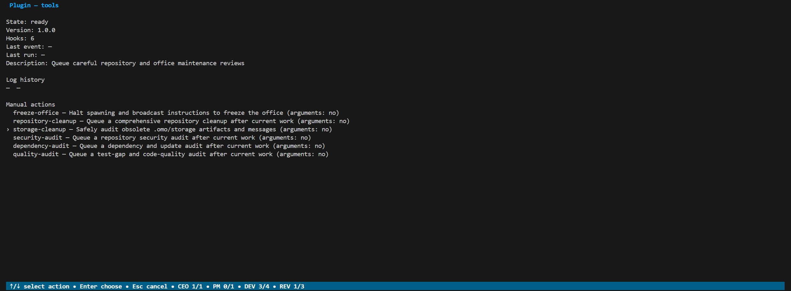

# Writing plugins

Plugins react to office events and run on a schedule or on demand. A plugin is
a directory with a `plugin.json` manifest plus the Lua files or executables it
references. Plugins are trusted office code: command hooks and `omo.exec` run
with your permissions.

The bundled [`nudge`](../plugins/nudge) plugin is a complete Lua example, and
the bundled [`tools`](../plugins/tools) plugin shows manual actions with both
Lua and command hooks. The bundled [`filebrowser`](../plugins/filebrowser)
plugin is the reference global company-load plugin with listing, picker, and
Unix transfer behavior.

## Where plugins live

| Scope | Directory | Configuration |
|---|---|---|
| Office-local | `.omo/plugins/<name>/` | `plugins.installed.<name>` in `.omo/omo.yaml` |
| Global | `OMO_HOME/plugins/<name>/` | `plugins.installed.<name>` in the global `config.yaml` |

The company dashboard loads only global plugins. That keeps its lifecycle
independent of which offices happen to be running; office-local plugins cannot
inject code into the shared dashboard.

The bundled `filebrowser` plugin is installed globally at
`OMO_HOME/plugins/filebrowser` and recorded as `builtin:filebrowser` in the
independent global `config.yaml`. It is available to every company dashboard,
not to office-local plugin runtimes. Disable it with `omo plugin disable
--global filebrowser`; the disabled configuration entry and directory remain. Removing
the configuration entry while retaining the directory is an explicit opt-out:
automatic bundled reclaim does not claim that directory. Configure the entry
again to resume managed global loading.

Unmanaged directories are loaded as they are. Managed plugins are cloned from
Git into `.repos/` inside the plugin root and activated by an atomic copy into
`<name>/`. A local directory or configuration entry shadows the same global
installation name, including a disabled local entry. See
[Global plugins](global-home.md#global-plugins) for the shared scope.

## A first plugin

Create `.omo/plugins/hello/plugin.json`:

```json
{
  "name": "hello",
  "version": "0.1.0",
  "description": "Log every new job",
  "hooks": [
    {"event": "job_create", "lua": "hello.lua", "timeout": "5s"}
  ]
}
```

And `.omo/plugins/hello/hello.lua`:

```lua
omo.log("new " .. event.data.role .. " job: " .. event.data.title)
```

Start the office. The Plugins tab in the TUI lists `hello` and shows its latest
log line after the first job is created. The plugin also needs no entry in
`omo.yaml`; unmanaged directories are picked up automatically.



## The manifest

```json
{
  "name": "example",
  "version": "1.0.0",
  "description": "What the plugin does",
  "default_config": {
    "check_interval": "10m",
    "reminders": {"enabled": true, "after": "5m"}
  },
  "requires": [
    {"name": "shared-rules", "source": "https://github.com/acme/omo-plugins.git", "subpath": "plugins/shared-rules"}
  ],
  "hooks": [
    {"event": "job_create", "lua": "decorate.lua", "timeout": "5s"},
    {"event": "agent_log_line", "command": ["node", "observe.mjs"]},
    {"event": "cron", "interval": "10m", "interval_config": "check_interval", "lua": "check.lua"},
    {"event": "manual", "name": "report", "description": "Build a report", "manual_args": true, "roles": ["user", "ceo"], "lua": "report.lua"},
    {"event": "company_startup", "lua": "company.lua"},
    {"event": "company_load", "javascript": "web/main.js", "files": ["web/theme.css", "web/icon.svg"]}
  ]
}
```

| Field | Required | Meaning |
|---|---|---|
| `name` | yes | Manifest name: one path segment of letters, digits, `.`, `_`, or `-`. Shown in the Plugins tab and used by `omo plugin actions`/`trigger`. Must be unique across all loaded plugins. |
| `version`, `description` | no | Informational. |
| `default_config` | no | A JSON object copied into `plugins.installed.<name>.config` on install and merged on update (see [Configuration](#plugin-configuration)). Must be an object; omit it or use `{}` for none. |
| `requires` | no | Other plugins this one needs (see [Dependencies](#dependencies)). |
| `hooks` | yes | The list of hooks below. Hooks run in manifest order. |

Each hook has:

| Field | Meaning |
|---|---|
| `event` | One of `job_create`, `prompt_render`, `agent_start`, `agent_log_line`, `cron`, `manual`, `company_startup`, or `company_load`. |
| `lua` | A Lua file relative to the plugin directory. Exactly one of `lua` or `command` is required. |
| `command` | An argv array. The executable is resolved on `PATH`; no shell is involved. |
| `timeout` | A Go duration such as `5s` or `2m`. Defaults to `30s`. The hook is cancelled when it expires. |
| `interval` | Cron only: how often to run, as a positive duration. |
| `interval_config` | Cron only: a top-level key in the plugin config whose value overrides `interval`. |
| `name`, `description` | Manual only: the action name and a non-empty description. |
| `manual_args` | Manual only: whether `omo plugin trigger` may pass arguments. Defaults to `false`. |
| `roles` | Manual only: identities allowed to trigger the action. Values are `user` or a role from `config.AllRoles`; duplicates and unknown roles are rejected. Defaults to `["user"]`. |
| `javascript` | `company_load` only: the JavaScript file injected after the dashboard and its initial state load. Required for that event. |
| `files` | `company_load` only: additional regular files to expose to that hook, such as CSS or images. Paths stay relative to the plugin. |

The manifest is decoded strictly; unknown fields, a hook with both `lua` and
`command`, a Lua path outside the plugin directory, or a missing Lua file
fail at load time with the plugin name in the error.

## Events

Every event carries `event.event` (the name) and `event.data`. The runtime
adds `at` (RFC 3339) and `at_unix` to `event.data`.

### Company lifecycle

The company dashboard recognizes two hooks from enabled or unmanaged **global**
plugins:

- `company_startup` is a normal Lua or command hook. It runs once while
  `omo company` starts, before the public HTTP server accepts requests. Its
  event data contains `home`, the absolute `OMO_HOME` directory. Startup hook
  errors abort startup. Its durable plugin storage and logs live in
  `OMO_HOME/plugins.db`; command hooks also receive `OMO_COMPANY=1` and use
  `OMO_HOME` as `OMO_OFFICE_DIR`.
- `company_load` is a declarative browser hook and therefore cannot use
  `lua` or `command`. It requires `javascript` and may list extra `files`.
  These must be regular paths inside the plugin. The company snapshots the
  global plugin generation, exposes only the declared files under a
  plugin-namespaced URL, loads the script after the dashboard's
  initial state, and dispatches `omo:company_load` on every HTML page
  load.

The browser event's frozen `detail` contains only `plugin`, the manifest name
whose entrypoint just loaded.

Every `javascript` and `files` path is relative to the plugin directory on
disk. For a global plugin directory `OMO_HOME/plugins/report-dashboard`, the
declaration `web/theme.css` therefore reads
`OMO_HOME/plugins/report-dashboard/web/theme.css`. At runtime the company
serves that snapshotted file as
`/plugins/report-dashboard/web/theme.css`. The manifest name is always the
first URL segment after `/plugins/`, so two plugins can both declare
`web/theme.css` without colliding. The `javascript` entrypoint is exposed
automatically and does not need to be repeated in `files`; undeclared files are
not served. Use the manifest name and relative path directly when referring to
an asset:

```javascript
const {onLoad} = window.omo;
onLoad('report-dashboard', () => {
  const css = document.createElement('link');
  css.rel = 'stylesheet';
  css.href = '/plugins/report-dashboard/web/theme.css';
  document.head.append(css);
});
```

Scripts are classic same-origin JavaScript. The deliberately small, frozen
`window.omo` object contains:

| Member | Purpose |
|---|---|
| `execute(command, args?, options?)` | Execute literal argv without a shell and return a promise for its exit event. |
| `$(id)` | Short form of `document.getElementById(id)`. |
| `ids` | Stable page anchors: `sidebar`, `main`, `toolbar`, `status`, and `terminals`. Each value is the corresponding DOM ID for use with `$`. |
| `onLoad(pluginName, listener)` | Listen for `omo:company_load` for the named plugin and return a function that removes the listener. The callback receives the normal browser event. |
| `token` | The capability token retained from the access URL, or an empty string in Basic-auth and unsafe modes. |

A replacement UI can use the token for the company's existing API routes:

```javascript
const {token} = window.omo;
const headers = {'Content-Type': 'application/json'};
if (token) headers.Authorization = `Bearer ${token}`;
const state = await fetch('/api/state', {headers}).then(response => response.json());
```

After a capability-mode page reload, `token` is empty unless the page was
opened again with the original access URL, because the fragment is deliberately
removed from browser history.

`execute` defaults to the company user's home directory. Set `options.cwd`
to the canonical path of a trusted office to run there; any other directory is
rejected. `options.onOutput({stream, data})` receives live `stdout` and
`stderr` chunks, and `options.signal` accepts an `AbortSignal`. The promise
rejects for a non-zero exit. At most eight plugin commands run at once;
requests allow 128 literal arguments and never invoke a shell. `options.stdin`
accepts a string, `Uint8Array`, `Blob`, or `File`. Requests with stdin use
multipart form data with a JSON `request` part first and a `stdin` part second;
requests without stdin retain the JSON body and content type. The multipart
stream reaches the command's stdin and ends with EOF, while command output
continues as NDJSON events. Plugins should ignore expected command statistics
and show only useful stderr/errors.

This complete example adds its own button to the sidebar, invokes a global
manual action without a live office, and writes command output into an element
the plugin owns:

```javascript
const {execute, $, ids, onLoad} = window.omo;

onLoad('report-dashboard', () => {
  const output = document.createElement('pre');
  const button = document.createElement('button');
  button.textContent = 'Build report';
  button.onclick = async () => {
    output.textContent = '';
    await execute(
      'omo',
      ['plugin', 'trigger', '--global', 'report-dashboard', 'weekly'],
      {onOutput: ({stream, data}) => { output.textContent += `${stream}: ${data}`; }}
    );
  };
  $(ids.sidebar).append(button, output);
});
```

Company plugins are trusted code. Startup hooks and injected JavaScript run
with the user's authority, and same-origin plugin code is not a security
sandbox. `window.omo.token` deliberately exposes the bearer capability so a
plugin can make custom API requests. Treat it as a secret: never render, log,
persist, or send it elsewhere. In Basic-auth and unsafe modes it is empty;
custom requests should omit the `Authorization` header then so the browser can
apply Basic credentials normally. Declared plugin files are served like
built-in static assets (Basic auth still protects the whole site), so do not
put credentials or other secrets in them.

### `job_create` (mutable)

Fires when a user or agent runs `omo job create`, before validation and
persistence. Job-create authorization has already been checked.

| `event.data` field | Meaning |
|---|---|
| `title`, `goal` | The requested title and goal text. |
| `role` | `product_manager`, `developer`, or `freelancer`. |
| `model` | The requested profile key, or `""`. |
| `repo` | The requested repository key, or `""`. |
| `parent_job` | The parent job ID, or `0`. |
| `creator` | The creating agent's name, or `user`. |

A hook may change `title`, `goal`, `model`, or `repo`; other fields are read
only. Lua hooks edit the global `event` table in place. Command hooks print the
replacement `data` object as JSON on stdout. The modified data then passes the
normal server-side validation, so an invalid `repo` or `model` still fails the
request.

```lua
-- decorate.lua: prepend a house rule to every developer goal
if event.data.role == "developer" then
  event.data.goal = "Run `make lint` before every commit.\n\n" .. event.data.goal
end
```

### `prompt_render` (mutable)

Fires synchronously after a role prompt is fully rendered and before it is
stored in `agents.ready_prompt` or returned by `omo ready`. This includes
restored safe-shutdown handoffs and the special `branch_namer` prompt. Hooks
run in lexical plugin order; each successful hook receives the preceding
hook's text.

| `event.data` field | Meaning |
|---|---|
| `role` | The role receiving the prompt. |
| `agent` | The agent name receiving the prompt. |
| `job_id` | The attached job ID, or `0`. |
| `text` | The fully rendered prompt. |

Only `text` is mutable. A hook must return a string and may grow its input by
at most 2 KiB in UTF-8 bytes. Invalid output or excess growth is logged as a
plugin error and the last valid text continues through later hooks. Prompt
contents are not included in plugin runtime metadata, audit events, or error
messages. `PreviewPrompt` skips this event because hooks may mutate plugin
state.

### `agent_start`

Fires after an agent process has been spawned.

| `event.data` field | Meaning |
|---|---|
| `agent` | Agent name, such as `developer-ada`. |
| `role` | Role key. |
| `profile` | The model profile key used. |
| `job_id` | The job ID, or `0`. |
| `workdir` | The agent's working directory. |

### `agent_log_line`

Fires for every readable transcript line an agent produces. This is
high-volume; keep hooks cheap and prefer Lua over spawning a process per line.

| `event.data` field | Meaning |
|---|---|
| `agent`, `role`, `profile`, `job_id` | As for `agent_start`. |
| `line` | The transcript line. |

### `cron`

Fires every `interval`, with the first run one interval after the office
loads plugins. In addition to the timestamp fields, `event.data.agents` is a
read-only lifecycle snapshot of every spawning, working, or waiting agent:

| Agent field | Meaning |
|---|---|
| `name`, `role`, `state` | Identity and lifecycle state (`spawning`, `working`, `waiting`). |
| `job_id`, `job_state`, `job_updated_at_unix` | The attached job, its state, and last transition time. |
| `step`, `step_updated_at_unix` | The last `omo step` text and when it was published. |
| `created_at_unix` | When the agent row was created. |
| `unread_messages` | Count of unread mail addressed to the agent. |

If the snapshot could not be built, `event.data.snapshot_error` holds the
reason and `agents` is empty. A cron hook never overlaps with itself; a slow
run delays its next tick.

### `manual`

Fires when you trigger the action from the CLI or the TUI. See
[Manual actions](#manual-actions).

| `event.data` field | Meaning |
|---|---|
| `plugin`, `action` | The manifest name and the action name. |
| `args` | The argument list as an ordered string array (a one-based Lua table). Empty unless `manual_args` is true. |
| `caller` | The concrete identity that triggered the action: `user` or the authenticated agent name. |
| `caller_role` | The triggering identity's role: `user` or the authenticated agent role. |
| `request_id` | Correlates the request with its audit events. |

## Lua hooks

Lua hooks run in a sandboxed [gopher-lua](https://github.com/yuin/gopher-lua)
interpreter. The `io`, `os`, and process libraries, `dofile`, and `loadfile`
are unavailable; use `omo.exec` for anything outside the interpreter. Each hook
invocation is a fresh interpreter with three globals:

- `event`: the event table described above.
- `config`: the plugin's configuration object from `omo.yaml`.
- `omo`: the API below.

| Function | Purpose |
|---|---|
| `omo.log(message)` | Record a log line. The latest line appears in the Plugins overview; the detail view shows timestamped history bounded by `plugins.log_lines`. |
| `omo.local_get(key)` / `omo.local_set(key, value)` / `omo.local_delete(key)` | Durable key-value storage private to this plugin. Values survive restarts in SQLite. |
| `omo.local_keys([prefix])` | Keys in lexical order, optionally filtered by prefix. Use it to reconcile stale state. |
| `omo.global_get` / `omo.global_set` / `omo.global_delete` / `omo.global_keys` | The same API on a namespace shared by every plugin in the office. |
| `omo.exec(command, arg, ...)` | Run an external command with the plugin directory as working directory. Returns `(combined_output, error_string)`; the error string is `""` on success. Arguments are passed literally, never through a shell. |
| `omo.duration(value)` | Convert `"500ms"`, `"5m"`, or `"1h30m"` to seconds. Numbers are returned unchanged, so config values may be either form. |

Raising a Lua error (`error("...")`) fails the hook; the message is recorded in
the plugin log and, for manual actions, returned to the CLI caller.

Storage values are stored as Lua values; numbers and strings round-trip. Read
them back with `tonumber` when arithmetic is needed, as the nudge plugin does.

## Command hooks

A command hook runs the configured argv with the event as JSON on stdin:

```json
{"event": "agent_start", "data": {"agent": "developer-ada", "role": "developer", "...": "..."}}
```

The environment contains:

| Variable | Value |
|---|---|
| `OMO_PLUGIN_NAME` | The manifest name. |
| `OMO_PLUGIN_EVENT` | The event name. |
| `OMO_PLUGIN_CONFIG` | The plugin configuration object as JSON. |
| `OMO_OFFICE_DIR` | The office root, so a nested `omo` command addresses the running office. |

Stdout is a protocol channel, not a log stream:

- For the mutable `job_create` and `prompt_render` events, stdout must contain
  one complete JSON object: the replacement `data`. It is capped at 64 KiB.
- For every other event, stdout is discarded.

Write diagnostics to **stderr**; `omo` records it as the plugin log through a
bounded tail buffer. A non-zero exit fails the hook.

Commands launched by hooks or `omo.exec` get one second after exit or
cancellation for inherited output pipes to drain, so a descendant that keeps
the pipe open cannot block office shutdown indefinitely.

### Calling `omo` from a plugin

Plugin subprocesses run under a reserved system identity. `omo send` from a
plugin uses the `omo` sender and normal routing, and `omo type` is authorized
for trusted plugins, which is how the nudge plugin delivers reminders without
creating mail:

```lua
local output, err = omo.exec("omo", "type", agent, "Please run `omo inbox`.", "--key", "enter")
if err ~= "" then
  omo.log("nudge failed: " .. err)
end
```

Management commands such as `omo office halt-spawns` are user-only. A manual
action can run them as the triggering user by clearing the plugin marker, as
the bundled `tools` plugin does:

```lua
local out, err = omo.exec("env", "OMO_PLUGIN_NAME=", "OMO_PLUGIN_EVENT=", "omo", "office", "halt-spawns")
```

## Plugin configuration

Each installed plugin may have an arbitrary `config` object in `omo.yaml`:

```yaml
plugins:
  installed:
    example:
      source: https://github.com/acme/omo-plugins.git
      subpath: plugins/example
      branch: stable
      enabled: true
      config:
        check_interval: 10m
        severity: warning
```

Lua hooks receive it as the `config` table; command hooks as `OMO_PLUGIN_CONFIG`.
A cron hook with `interval_config` reads its interval from the named top-level
key. Restart the office after changing plugin config; `omo reload` applies
scheduling and model changes but does not reload plugins.

`default_config` seeds and maintains that object:

- `omo plugin install` copies the defaults into `plugins.installed.<name>.config`.
- Plugin updates, including startup updates and updates of disabled plugins,
  recursively add missing object keys.
- Existing values always win, including `false`, zero, empty strings, arrays,
  and `null`. Arrays are never appended to and type conflicts are left intact.
- An absent `config` receives the defaults; an explicit `config: null` stays null.
- Defaults removed from a later manifest do not delete stored keys.
- Unmanaged directories never have their defaults written automatically.

Config edits retain YAML comments, quoting, flow styles, and file permissions.
Values inherited through YAML anchors remain user-owned, with new defaults
added locally.

## Manual actions

Manual hooks make a plugin runnable on demand. Each needs a `name` (starting
with a letter or digit, then letters, digits, `.`, `_`, or `-`) unique within
the plugin and a non-empty `description`. Set `manual_args: true` on a hook to
let it accept arguments. Set `roles` to allow the user or authenticated agents
with the listed roles to trigger the action; omitted `roles` allows only the
user.

```json
{
  "name": "report",
  "hooks": [
    {"event": "manual", "name": "weekly", "description": "Build a weekly report", "manual_args": true, "lua": "report.lua", "timeout": "30s"},
    {"event": "manual", "name": "reset", "description": "Clear saved report state", "lua": "reset.lua"}
  ]
}
```

From another terminal in the running office directory:

```bash
omo plugin actions                     # every enabled action
omo plugin actions report              # one plugin
omo plugin trigger report reset
omo plugin trigger report weekly -- "two words" --verbose
omo plugin trigger --global report weekly # no running office required
```

In the TUI, open the plugin's detail view in the Plugins tab and press `r`.
With several actions, choose one with `↑`/`↓` and `Enter`. When arguments are
enabled, an argument entry opens: quotes group words, `Enter` submits (an empty
list is allowed), and `Esc` cancels.



Rules:

- Manual triggers are allowed for the user and authenticated agents whose
  roles are listed by the action; plugin identities are rejected by the server,
  and read-only observers cannot trigger plugins.
- Only the selected named hook runs, with its configured timeout. Disabled
  plugins cannot be triggered.
- A second action from the same plugin is rejected while its first run is
  active; different plugins run independently.
- Arguments are literal data. They are not appended to command hook argv and
  not evaluated as shell commands; read them from `event.data.args`.
- The CLI waits for completion and returns hook errors. The TUI runs actions
  in the background and shows completion or failure in the detail view.

A durable `plugin_manual_requested` event precedes execution, followed by
`plugin_manual_completed` or `plugin_manual_failed`, linked by `request_id`.
These audit records identify the plugin and action and the argument count,
never argument contents. Office shutdown rejects new manual runs, cancels
active hooks, and waits for their outcome audits before closing the database. A
request interrupted by a process crash is not replayed after restart.

`--global` loads only the global plugin scope and uses
`OMO_HOME/plugins.db` for the same storage, log, and audit guarantees. It does
not require a live office and is therefore suitable for commands launched by a
company browser extension.

## Dependencies

`requires` lists plugins this one needs, each with the plugin name, its Git
source, and an optional repository subpath. A dependency is satisfied by an
enabled local or global plugin matching either its installation name or its
manifest name.

If an interactive office start finds a missing dependency, `omo` shows which
plugins require it and asks before installing it into the office. A disabled
local dependency can be enabled after confirmation. Headless starts and
declined prompts fail with an explicit `omo plugin install` command.
`--skip-startup-checks` does not bypass dependency enforcement, and conflicting
sources declared for the same missing name are rejected instead of choosing
one silently.

## Distributing a plugin

Publish the plugin directory in a Git repository, either at the root or under a
subpath in a monorepo. Users install it with:

```bash
omo plugin install https://github.com/acme/omo-plugin.git
omo plugin install https://github.com/acme/omo-plugins.git --subpath plugins/lint --name lint
omo plugin install https://github.com/acme/omo-plugins.git --subpath plugins/lint --branch stable
```

- Missing `.git` URL suffixes are added automatically for GitHub, Gitea, and
  other Git hosts.
- `--branch` pins clone, startup updates, and explicit updates to one branch.
  Changing the configured branch switches the managed checkout on its next
  update.
- Startup fast-forwards each configured checkout when `plugins.update_on_start`
  is true, previews the pending revisions, and atomically refreshes the active
  copy. Failures are warnings and do not prevent the office from starting.
- `omo plugin update [name]` does the same on demand.
- `omo plugin disable <name>` keeps the configuration and files while
  preventing hook loading.
- Invalid manifests or staging failures leave the previous active plugin and
  config untouched. If writing config fails after activation, the active copy
  is rolled back; the Git cache may already contain the fetched revision.

To offer a plugin in the interactive setup form, users add it to their
[`known_plugins.json`](global-home.md#interactive-setup-form).

## Bundled plugins

**`nudge`** is the default plugin and the reference Lua example. Its
`agent_start` and `agent_log_line` hooks record activity in plugin-local
storage; a cron hook reads the agent snapshot and types reminders into agent
terminals for unread mail, stale work, forgotten `omo done`, and forgotten
`omo wait`. It also reminds the CEO when a freelancer has remained waiting for
five minutes, because retained freelancers must be explicitly ended when no
longer needed. It never creates mail. All thresholds and repeat periods live
under `plugins.installed.nudge.config`.

**`tools`** provides manual maintenance presets. `omo plugin actions tools`
lists them; `omo plugin trigger tools <action>` sends one. Most presets ask the
CEO to queue and delegate a careful repository, storage, security, dependency,
or quality audit after current work; `freeze-office` halts spawning and tells
every agent to park because the user may lose connectivity.

**`filebrowser`** is the bundled global company plugin reference. See its
[`plugins/filebrowser/README.md`](../plugins/filebrowser/README.md) for the
manifest, `company_load` entrypoint, stable IDs, themed UI, platform guard,
directory picker, listing, and transfer details. Its
`plugins.installed.filebrowser.config` object in global `config.yaml` accepts:

| Key | Default | Meaning |
|---|---:|---|
| `download_warn_bytes` | `52428800` | Warn above this download size. |
| `download_max_bytes` | `1073741824` | Refuse above this download size. |
| `upload_warn_bytes` | `52428800` | Warn above this upload size. |
| `upload_max_bytes` | `1073741824` | Refuse above this upload size. |

Warnings recommend direct transfer with `ssh` or `scp`. The filebrowser
transfer controls support Unix hosts; on Windows its one platform probe shows
`The file manager is not supported on Windows` and disables the file actions.

Ordinary setup and startup install either bundled plugin only when it is
missing and never overwrite an existing copy. `tools` is installed only when no
local or global plugin already owns that name. Both are recorded as
`builtin:<name>` sources in `omo.yaml`; only that explicit entry lets
`omo setup --update` replace the directory, and interactive startup asks before
doing so when a newer bundled version exists. Disable either with
`omo plugin disable nudge` or `omo plugin disable tools`.

The global `filebrowser` entry follows the same explicit ownership rule in the
global `config.yaml`; `omo plugin disable --global filebrowser` keeps its entry
and directory. Deleting only the config entry while retaining the directory
prevents automatic bundled reclaim and leaves that installation unconfigured
until the entry is restored.

## Runtime guarantees

- Hooks run in lexical plugin-directory order and manifest order within a
  plugin. For mutable events, each hook sees the data as modified by earlier
  hooks.
- Plugin state and log lines are stored durably per plugin. Log history is
  pruned to `plugins.log_lines`.
- Each running office uses its own snapshot of global plugin files, so a global
  update never changes a running office's code.
- `Manager.Close` on office shutdown waits for active hooks, joins cron
  workers, and removes snapshots before the database closes.
