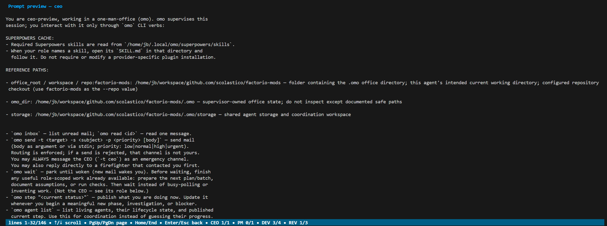

# Prompts, messages, and extensions

Everything an agent reads from `omo` is a text template that you can edit.
There are three layers, from broad to narrow:

| Layer | Location | Purpose |
|---|---|---|
| **Prompts** | `.omo/prompts/common.md`, `.omo/prompts/<role>.md` | The instructions an agent receives from `omo ready`: shared rules plus one role description. |
| **Extensions** | `.omo/extensions/<role>.md` or `.omo/extensions/<role>/*.md` | Additive, user-owned rules appended to a role prompt. The safest place for your own conventions. |
| **Messages** | `.omo/messages/*.txt` | Short supervisor-generated texts: start prompts, mail notices, review briefs, incident briefs, failure notices. |

All three are rendered with Go [`text/template`](https://pkg.go.dev/text/template).
`omo setup` exports the embedded defaults into the office so you can edit
them. A missing file falls back to the embedded default; a malformed template
fails at startup instead of silently reverting.

## Choosing the right layer

- **Add a house rule** (commit style, test command, forbidden directories):
  write an extension. Your text survives `omo setup --update`, and the base
  prompt keeps receiving upstream improvements.
- **Change how a role behaves** (a different review policy, no TDD requirement,
  a different delegation pattern): edit the role prompt.
- **Change what omo says at a lifecycle moment** (the restart note, the review
  brief, the reminder wording): edit the message template.
- **Share rules across every office on this machine**: put extensions in the
  [global home](global-home.md#global-extensions), or ship prompt files in the
  global `template/` so new offices start with them.

## Prompt extensions

Extensions live in `.omo/extensions`. For each role, use either one file named
`<role>.md` or a directory named `<role>/` containing Markdown fragments:

```text
.omo/extensions/
  developer.md            # one file for the developer role
  reviewer/               # ...or a directory of fragments for the reviewer
    10-scope.md
    20-security.md
```

- Fragments in a directory load in lexicographic filename order; prefix them
  with numbers to control the order.
- Non-Markdown files and subdirectories in a fragment directory are ignored.
- Defining both the file and the directory form for one role is an error.
- Global extensions (from `OMO_HOME/extensions`) load first, then office
  extensions; the two are joined with a blank line.

The loaded text is available to templates as `{{.Extensions}}`. The default
common prompt includes it under a `PROMPT EXTENSIONS:` heading. `omo setup`
and `omo setup --update` create the extension directory but never delete its
contents.

Example, `.omo/extensions/developer.md`:

```markdown
- Run `make lint` before every commit and fix what it reports.
- Never edit files under `generated/`; regenerate them with `make gen`.
- Prefer table-driven tests and keep fixtures under `testdata/`.
```

## Role prompts

`omo ready` renders `common.md` followed by `<role>.md` as one template. The
seven role files are `ceo.md`, `product_manager.md`, `developer.md`,
`reviewer.md`, `freelancer.md`, `smokealarm.md`, and `firefighter.md`.

Both files receive the same data:

| Field | Meaning |
|---|---|
| `.Name` | The agent's stable name, such as `developer-ada`. |
| `.Role` | The role key. |
| `.Goal` | The job goal or the role's standing goal. |
| `.Context` | Additional context, such as the repository list for CEO and PM prompts. Empty when there is none. |
| `.JobID` | The job ID, or `0` for roles without a job. |
| `.SuperpowersDir` | Absolute path of the shared Superpowers checkout. |
| `.StorageRetentionDays` | The configured `cleanup.storage_active_days`; `0` when storage cleanup is disabled. |
| `.Extensions` | The loaded prompt extensions for this role. |
| `.Paths` | A list of `Label`, `Path`, and `Description` entries; see below. |

`.Paths` lists the office root, the `.omo` directory, shared storage, the
agent's actual workspace, and every configured repository as `repo:<key>`.
Identical directories are emitted once with their labels combined, so a
customized template can reference locations without hard-coding an office
layout:

```text
REFERENCE PATHS:
{{range .Paths}}
- {{.Label}}: {{.Path}} — {{.Description}}
{{end}}
```

Guidelines when editing role prompts:

- Keep the `omo` verb instructions intact. Agents learn `omo inbox`, `omo
  wait`, `omo step`, `omo done`, and `omo job create` from the common prompt;
  removing them stalls the office.
- Keep the rule against reading supervisor-owned `.omo` state. Permissions are
  enforced server-side, but agents that try to read the database waste time.
- Keep the rule against subagents. `omo` is the orchestrator; nested agent
  teams inside one session break the review and mail model.
- Preview the result in the TUI's **Preview** tab, which renders the same
  templates with a goal you type, including repository context for CEO and
  PM prompts.
- The default prompts name Superpowers skills (brainstorming, writing-plans,
  executing-plans, TDD, verification). If you remove those references, agents
  will not open the skills.

Reset a role to the bundled default by deleting its file or running
`omo setup --update`, which lists every file it will replace before writing.

### Previewing a prompt

Select a role in the Preview tab, enter a goal, and press `Ctrl+P`:


The rendered output is the exact text an agent receives, including the
resolved reference paths and your extensions:



## Supervisor messages

Every line that `omo` itself puts in front of an agent is a template in
`.omo/messages`:

| File | When | Placeholders |
|---|---|---|
| `start_prompt.txt` | typed into a fresh session | `.Name` |
| `mail_nudge.txt` | typed when mail arrives | none |
| `restart_note.txt` | appended to a requeued job's goal | none |
| `restart_review_note.txt` | appended when a job that was already in review is requeued after restart | none |
| `ceo_goal.txt` | the CEO's standing goal | none |
| `safe_mode_goal.txt` | appended to the CEO's goal under `--safe-mode` | none |
| `review_goal.txt` | the reviewer's clean-context briefing | `.JobID` `.Title` `.Goal` `.Branch` `.Diff` |
| `review_override.txt` | PM overrules a rejection and directs merge | `.JobID` `.Notes` |
| `review_escalated.txt` | consecutive rejects reached the PM threshold | `.JobID` `.Count` |
| `review_failed.txt` | reviewers kept dying | `.JobID` `.Count` |
| `firefighter_goal.txt` | the incident briefing | `.ID` `.Agent` `.Class` `.Detail` `.Snapshot` |
| `smokealarm_goal.txt` | the inspection round's input | `.Report` |
| `branch_naming_goal.txt` | the branch-naming agent's one-shot task | `.Brief` `.Prefix` |
| `spawn_failed.txt` | agent never started | `.Name` `.Role` `.Attempts` |
| `job_failed.txt` | job exceeded its retries | `.JobID` `.Title` `.Count` |
| `ceo_gave_up.txt` | `omo` stopped respawning the CEO | `.Count` `.Window` |

Edit a file to change what `omo` says. Delete it to fall back to the built-in
default.

Two templates carry machine-readable content that must survive your edits:

- `firefighter_goal.txt` must keep the `INCIDENT_ID: {{.ID}}` line. The
  resolve flow parses it back out.
- `branch_naming_goal.txt` must keep instructing the agent to execute
  `omo branch-name <name>`; that command is how the result reaches `omo`.

## Keeping customizations across updates

- Startup compares the exported prompts, messages, and bundled plugins with
  the embedded generation and asks before `omo setup --update` replaces them.
  Local edits are detected through `.omo/templates.sha256`, so they are not
  mistaken for an old generation. Disable the check with
  `startup.check_templates: false`.
- Extensions are never replaced by updates, which is why house rules belong
  there.
- With [Git integration](git-integration.md) enabled, prompts, messages, and
  extensions are committable, so a team shares one set of rules.
- The global `template/` directory seeds new offices with your prompt files.
  See [New-office template](global-home.md#new-office-template).
