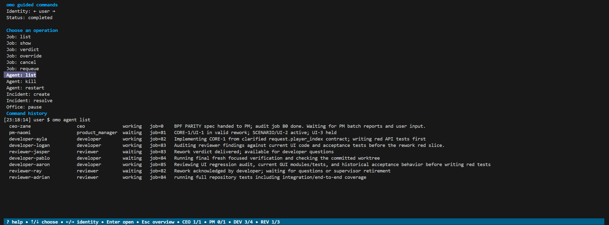
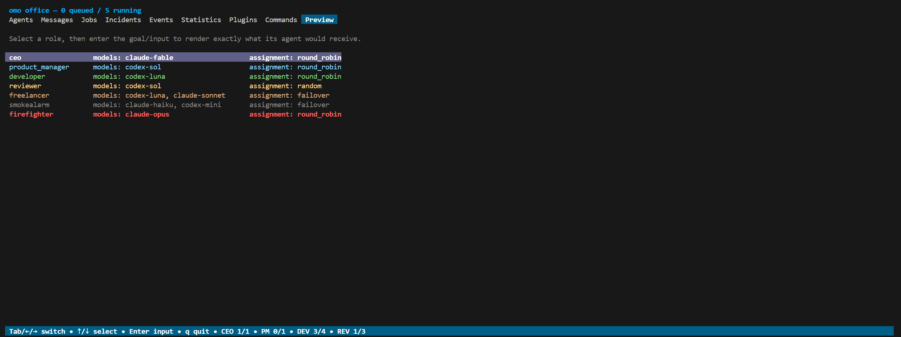

# The TUI

The TUI has two main surfaces: **Peek**, which shows one agent's live
terminal, and **Overview**, a tabbed view of the whole office.

## Peek

Peek is the home screen and starts on the CEO. It shows the selected agent's
live terminal. Everything you type goes to that terminal, so talking to the CEO
is simply using its session.

Controls:

- `Ctrl+O` or `Ctrl+Q`: overview. `Ctrl+O` exists because a terminal-level
  `Cmd+Q` on macOS cannot be intercepted by a terminal application.
- `Ctrl+T`: toggle read-only.
- `m`: open a message composer for this agent while read-only.
- `p`: show the exact prompt returned to this agent by `omo ready` while
  read-only. The recorded prompt remains available after the session ends.

Peeking any agent other than the CEO opens read-only, so a stray keystroke
cannot derail a working agent. Use `Ctrl+T` when you intentionally want to
type to it. A message sent with `m` returns to the same read-only agent view.

Mouse-wheel events are forwarded to the nested CLI, so its conversation stays
scrollable.

## Overview

Overview has nine tabs:

- **Agents**: live agents, ordered as an indented spawn tree so CEO -> PM ->
  developer -> reviewer relationships stay together.
- **Messages**: full office-message history, including read and inter-agent mail.
- **Jobs**: all jobs.
- **Incidents**: smoke-alarm incidents, including resolved findings.
- **Events**: the complete office event history.
- **Statistics**: current-session and all-time statistics.
- **Plugins**: installed plugin state, latest output, and scrollable retained log history.
- **Commands**: a command console that spawns a second `omo` CLI connected to
  the running office, captures its output in a persistent in-TUI log, and can
  run as the human user or impersonate any living agent under normal server
  permissions.
- **Preview**: a role prompt preview that accepts a prospective goal/input and
  renders the same editable common and role templates an agent would receive,
  including repository context for CEO and product-manager previews.

Statistics include separate current-session and all-time sections with
messages, agent starts by role and model, review outcomes, and active/idle
worker time per model. The Agents tab also shows the last successful weekly
usage check for every metered model profile as an ASCII bar and percentage;
these snapshots are persisted so read-only observers see the same values. CEO
time is an estimate based on whether its CLI transcript changes between
one-second samples.

**Agents**: the spawn tree with lifecycle state, published step, and the last
usage check per credential scope.

**Messages**: office mail with the selected message body below the table.

**Jobs**: every job with repository, branch, lineage, and the full goal.

**Incidents**: smoke-alarm findings and their resolution.

**Events**: the durable office event history.

**Statistics**: all-time and current-session totals per role and model.

**Plugins**: loaded plugins, their hook counts, and the latest log line.

Controls:

- `Tab` / `←` / `→` switch tabs.
- `↑` / `↓` select.
- `Enter` peeks the selected agent. In Messages, Jobs, Incidents, Events, and
  Plugins it opens the selected row in a full detail view. In Commands it opens
  the command console. In Preview it opens the role-input screen; enter a goal
  and press `Ctrl+P` to render the prompt.
- `r` in a plugin detail triggers one of its manual actions, with argument
  entry when that action allows arguments. See [Writing plugins](plugins.md#manual-actions).
- `x` reads a selected unread message addressed to you.
- `x` opens a contextual management menu on Agents and Jobs. Available actions
  reflect current state: kill/restart a living agent, cancel active work, or
  requeue a failed/cancelled job.
- `m` opens a message composer for the selected agent, or for the agent
  associated with the selected message.
- `q` opens the quit dialog. Choose immediate quit, cancel, or `s` for a
  separately confirmed [safe shutdown](running.md#safe-shutdown).
- `Ctrl+C` remains the immediate emergency stop.

Detail views preserve the complete message or record and scroll with
`↑` / `↓`, `PgUp` / `PgDn`, `Home` / `End`, or the mouse wheel. `Enter`,
`Esc`, `←`, or `q` returns to the table. Opening an unread user message marks
it read. Durable history tables, including Jobs, show newest entries first.

The live agent peek refreshes at 10 Hz, while overview and dialog modes
refresh at 2 Hz and still repaint immediately for input.

Controls appear in the footer only when they apply. Unread mail addressed to
you is pinned above other message history and shown as a footer indicator.
Agent-view footers fill remaining width with as many active/total role counts
as fit, starting with CEO and product managers.

### Message composer

The composer uses `Tab` to switch between subject and body, `Enter` for body
newlines, `Ctrl+S` to send, and `Esc` to cancel. Messages are sent as the
human user with normal priority.

### Command console

The Commands tab opens a guided operation browser. `↑`/`↓` chooses an
operation, `←`/`→` chooses the user or a living-agent identity, and `?` shows
contextual help. Forms label required inputs, show suggested values, validate
them, and build safely quoted commands. Operations that kill, cancel, remove,
override, or shut down require typing `yes` before execution. The final
`Advanced: raw command` item is a free-form runner for unusual flags;
subprocess execution still uses normal server-side permissions for the
selected identity and never invokes a shell. The console reserves its upper
half for the active operation and its lower half for command history.

### Prompt preview

The Preview tab lists every role with its configured profiles and assignment
method. Select a role, enter a goal, and press `Ctrl+P` to render exactly what
an agent of that role would receive from `omo ready`. See
[Prompts, messages, and extensions](prompts.md).

### Pending input

When automated terminal input is waiting, an injected-input marker appears in
the agent footer. If mail or `omo type` input arrives while you type into that
agent, `omo` waits for `notifications.input_debounce`, or for overview or
read-only mode, before inserting it. An inbox changing from empty to unread
inserts one notification; further messages remain durable without
interrupting another agent turn until that inbox has been cleared. Switching
away may leave partly composed text in the nested CLI, so compose long text
elsewhere and paste it when ready.

Agents publish their current activity with `omo step "..."`. The Agents tab
shows that description beside lifecycle state and job. Agents can inspect the
same live view with `omo agent list`.
